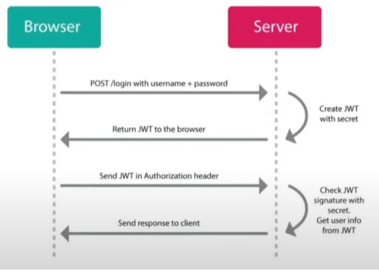

# Apuntes
En este repositorio voy a tener todos los apuntes de diferentes tecnologías estudiadas

## Temas
- [Nodejs](#nodejs)
- [PostgreSQL](#postgresql)
- [Typescript](#typescript)
- [Java](#java)
- [JavaStreams](#java-streams-y-funciones-lambdas)
- [SpringBoot](#spring-boot)
- [SpringSecurity](#spring-security)
- [ConceptosBackend](#conceptos-backend)
- [BasesDeDatos](#bases-de-datos)
- [POO](#poo---programación-orientada-a-objetos)

# NodeJS

## Autenticación

### Tokens
Para autenticar un usuario utilizar Json Web Tokens, y luego guardarlo en cookies. Las cookies son menos vulnerables a inyecciones maliciosas, ya que solo son accesibles por medio de http, no se pueden acceder a ellas a través de javascript. Además se puede configurar para que las cookies se envien solo con https. Lo que sí puedo devolver en la respuesta y guardar en local storage es la información del usuario que no sea sensible, como email, nombre de usuario, id, etc. No devolver contraseñas.
Los JWT se dividen en 3 partes:

- **Header**: Indica algoritmo y el tipo del token
- **Payload**: Contiene los datos codificados.
- **Signature**: Permite decodificar la información del payload.



### Cookies
Las cookies sirven para guardar información, la ventaja que tienen es que no pueden ser accedidas con código javascript malicioso, lo que le da más seguridad a una aplicación. La única manera de que otra persona robe información de las cookies es estando con nosotros en nuestra computadora.
Siempre un tercero, con el tiempo y las ganas suficientes, podrá desencriptar nuestra información, lo importante es que la misma ya no disponga de valor cuando éste logre hacerlo. Por eso a los token hay que darle un tiempo de expiración.

### Passwords:
Las contraseñas deben ser hasheadas antes de guardarlas en la base de datos. Ej: Bcrypt.

### Datos:
Validar los datos de entrada para que no te metan cualquier cosa en la base de datos.

### Errores:
Evitar devolver mensajes con demasiada información, porque es muy accesible para los atacantes. Crear errores propios extendiendo de la clase Error.


## Cors
Los cors son aplicados en los servidores para las solicitudes http de dominio cruzado que son iniciadas por el navegador, si el server tiene determinado dominio y el cliente(navegador) tiene otro dominio distinto, debemos indicarle al servidor que acepte dicho dominio para poder realizar solicitudes http desde el mismo. En la configuración de los orígenes de cors se pueden aceptar todos los dominios o indicar específicamente cuales queremos que estén permitidos.


Como se ve en el ejemplo, estoy aceptando los dominios http://localhost:5173 y http://www.turns.com.

## Documentación de API'S
Siempre ir documentando los endpoints mientras se codea, así después evitar errores. Para documentar apis utilizar swagger,  un conjunto de herramientas de software de código abierto para diseñar, construir, documentar, y utilizar servicios web RESTful. 
Se utiliza de la siguiente manera:

**Se documenta arriba del endpoint**

### Get
```javascript
/**
   * @swagger
   * components:
   *  securitySchemes:
   *    cookieAuth:
   *      type: apiKey
   *      in: cookie
   *      name: access_token
   *  schemas:
   *    Service:
   *      type: object
   *      properties:
   *        id:
   *          type: string
   *          format: uuid
   *        name:
   *          type: string
   *        duration:
   *          type: integer
   *          minimum: 1
   *          decription: duration of service in minutes
   *        price:
   *          type: integer
   *          minimum: 1
   *        is_active:
   *          type: boolean
   *          default: true
   *      required:
   *        - name
   *        - duration
   *        - price
   *      example:
   *        id: "545d029b-0b2c-4099-9b91-c3a9dc6b1231"
   *        name: "Corte y barba"
   *        duration: 30
   *        price: 6500
   *        is_active: true
  */
 serviceRouter.get('/', serviceController.getAll)
```
### Post
```javascript
/**
   * @swagger
   *  /api/v1/services:
   *    post:
   *      summary: Create a new service
   *      tags: [Service]
   *      security:
   *        - cookieAuth: []
   *      requestBody:
   *        required: true
   *        content:
   *          application/json:
   *            schema:
   *              type: object
   *              properties:
   *                name:
   *                  type: string
   *                duration:
   *                  type: integer
   *                  minimum: 1
   *                price:
   *                  type: integer
   *                  minimum: 1
   *              required:
   *                - name
   *                - duration
   *                - price
   *              example:
   *                name: "Haircut"
   *                duration: 45
   *                price: 100
   *      responses:
   *        201:
   *          description: Service created successfully
   *          content:
   *            application/json:
   *              schema:
   *                type: object
   *                properties:
   *                  status:
   *                    type: integer
   *                    example: 201
   *                  statusMessage:
   *                    type: string
   *                    example: "Success"
   *                  data:
   *                    type: object
   *                    $ref: '#/components/schemas/Service'
   *        403:
   *          description: Access not authorized
   *          content:
   *            application/json:
   *              schema:
   *                type: object
   *                properties:
   *                  status:
   *                    type: integer
   *                    example: 403
   *                  statusMessage:
   *                    type: string
   *                    example: "Access Not Authorized"
   *        422:
   *          description: Validation error
   *          content:
   *            application/json:
   *              schema:
   *                type: object
   *                properties:
   *                  status:
   *                    type: integer
   *                    example: 422
   *                  statusMessage:
   *                    type: string
   *                    example: "Validation Error"
   *                  error:
   *                    type: array
   *                    items:
   *                      type: object
   *                      properties:
   *                        field:
   *                          type: string
   *                          example: "name"
   *                        message:
   *                          type: string
   *                          example: "name must be a string"
   *        409:
   *          description: The service already exists
   *          content:
   *            application/json:
   *              schema:
   *                type: object
   *                properties:
   *                  status:
   *                    type: integer
   *                    example: 409
   *                  statusMessage:
   *                    type: string
   *                    example: "Already Exists"
   *                  error:
   *                    type: string
   *                    example: "The service already exists"
   *        400:
   *          description: Bad Request
   *          content:
   *            application/json:
   *              schema:
   *                type: object
   *                properties:
   *                  status:
   *                    type: integer
   *                    example: 400
   *                  statusMessage:
   *                    type: string
   *                    example: "Syntax Error"
   *                  error:
   *                    type: string
   *                    example: "Invalid object JSON provided"
   *        500:
   *          description: Failed Connection
   *          content:
   *            application/json:
   *              schema:
   *                type: object
   *                properties:
   *                  status:
   *                    type: integer
   *                    example: 500
   *                  statusMessage:
   *                    type: string
   *                    example: "Failed Connection"
   *                  error:
   *                    type: string
   *                    example: "Database is not available"
  */
 serviceRouter.post('/', serviceController.create)
```
### Patch
```javascript
/**
   * @swagger
   *  /api/v1/services/{id}:
   *    patch:
   *      summary: Edit service
   *      tags: [Service]
   *      security:
   *        - cookieAuth: []
   *      parameters:
   *        - in: path
   *          name: id
   *          required: true
   *          schema:
   *            type: string
   *            format: uuid
   *          description: The ID of the service to edit
   *      requestBody:
   *        required: true
   *        content:
   *          application/json:
   *            schema:
   *              type: object
   *              properties:
   *                name:
   *                  type: string
   *                duration:
   *                  type: integer
   *                  minimum: 1
   *                price:
   *                  type: integer
   *                  minimum: 1
   *              example:
   *                name: "Hair and beard cut"
   *                duration: 60
   *                price: 100
   *      responses:
   *        200:
   *          description: Service updated successfully
   *          content:
   *            application/json:
   *              schema:
   *                type: object
   *                properties:
   *                  status:
   *                    type: integer
   *                    example: 200
   *                  statusMessage:
   *                    type: string
   *                    example: "Success"
   *                  data:
   *                    type: object
   *                    $ref: '#/components/schemas/Service'
   *        403:
   *          description: Access not authorized
   *          content:
   *            application/json:
   *              schema:
   *                type: object
   *                properties:
   *                  status:
   *                    type: integer
   *                    example: 403
   *                  statusMessage:
   *                    type: string
   *                    example: "Access Not Authorized"
   *        400:
   *          description: Bad Request
   *          content:
   *            application/json:
   *              schema:
   *                type: object
   *                properties:
   *                  status:
   *                    type: integer
   *                    example: 400
   *                  statusMessage:
   *                    type: string
   *                    example: "Bad Request"
   *                  error:
   *                    type: string
   *                    example: "Invalid service ID provided"
   *        422:
   *          description: Validation error
   *          content:
   *            application/json:
   *              schema:
   *                type: object
   *                properties:
   *                  status:
   *                    type: integer
   *                    example: 422
   *                  statusMessage:
   *                    type: string
   *                    example: "Validation Error"
   *                  error:
   *                    type: array
   *                    items:
   *                      type: object
   *                      properties:
   *                        field:
   *                          type: string
   *                          example: "name"
   *                        message:
   *                          type: string
   *                          example: "name must be a string"
   *        404:
   *          description: Service not found
   *          content:
   *            application/json:
   *              schema:
   *                type: object
   *                properties:
   *                  status:
   *                    type: integer
   *                    example: 404
   *                  statusMessage:
   *                    type: string
   *                    example: "Not Found"
   *                  error:
   *                    type: string
   *                    example: "Service not found"
   *        409:
   *          description: The service already exists
   *          content:
   *            application/json:
   *              schema:
   *                type: object
   *                properties:
   *                  status:
   *                    type: integer
   *                    example: 409
   *                  statusMessage:
   *                    type: string
   *                    example: "Already Exists"
   *                  error:
   *                    type: string
   *                    example: "The service already exists"
   *        500:
   *          description: Failed Connection
   *          content:
   *            application/json:
   *              schema:
   *                type: object
   *                properties:
   *                  status:
   *                    type: integer
   *                    example: 500
   *                  statusMessage:
   *                    type: string
   *                    example: "Failed Connection"
   *                  error:
   *                    type: string
   *                    example: "Database is not available"
  */

serviceRouter.patch('/', serviceController.update)
```

## Testing
Instalar las dependencias supertest y vitest. Los test se realizan de la siguiente manera:


- **describe**: Se utiliza para agrupar pruebas relacionadas dentro de un describe puedes tener múltiples bloques it que definan pruebas individuales.
- **it**: Se utiliza para definir una prueba individual. Es donde se especifica el comportamiento esperado de una función. Cada it debería contener una única afirmación sobre lo que se está probando.


- **beforeAll**: Este método se ejecuta una sola vez antes de que comiencen todas las preubas en el bloque describe. Es útil para configurar el entorno de prueba, como inicializar conexiones a bases de datos, crear datos de prueba, o configurar dependencias.
- **afterAll**: Este método se ejecuta una sola vez después de que todas las pruebas en el bloque describe hayan terminado. Se utiliza para limpiar el entorno de prueba, como cerrar conexiones a bases de datos, eliminar datos de prueba, o liberar otros recursos.

## Producción
Cuando se lanza una web fullstack a poproducción en Vercel, al estar todo ruteado con React Router Dom, cuando se refresque una pagina esta no sera encontrada, para eso hay una solución, en el cliente crear un json ed esta manera con mismo nombre.


## Librerías
### Calendarios
React Date Range

### Fechas y horas
Dayjs
```javascript
dayjs('2018-08-08') // Crea una instancia de dayjs para la fecha indicada
dayjs().set('month', 3) // A la fecha actual se le cambia el més por el més índice 3 (Abril en javascript)
dayjs().add('year', 1) // A la fecha actual se le suma un año
dayjs().isBefore(dayjs()) // Indica si una fecha es menor que otra
dayjs(date, 'HH:mm') // Crea instancia de dayjs interpretando la cadena date como una hora en formato HH:mm
```

# PostgreSQL
## UUID
Para utilizar uuids en PostgreSQL, se extiende de la librería uuid-ossp.
```postgreSQL
CREATE EXTENSION IF NOT EXISTS "uuid-ossp"
```
Luego para crear un atributo uuid se llama a la función que se quiera, hay distintas versiones de uuid.
```postgreSQL
id_user UUID PRIMARY KEY DEFAULT uuid_generate_v4()
```

## Querys
### CREATE
```postgreSQL
CREATE TABLE users (
    id_user UUID PRIMARY KEY DEFAULT uuid_generate_v4(),
    name VARCHAR(255) NOT NULL,
    email VARCHAR(255) NOT NULL,
    password CHAR(60) NOT NULL,
    phone_number VARCHAR(20) NOT NULL,
    role user_role DEFAULT 'client'
)
```
### TRUNCATE
```postgreSQL
TRUNCATE TABLE services CASCADE
```
### INSERT
```postgreSQL
INSERT INTO services (name, duration, price) VALUES ('New Service Name', 30, 100)
```
### DELETE
```postgreSQL
DELETE FROM users WHERE id_user = 'ffnahbnf8aef'
```
### UPDATE
```postgreSQL
UPDATE users
SET name = 'oscar'
    phone_number = '438724834'
WHERE id_user = 'fjauehfy8q3'
```
### SELECT
```postgreSQL
SELECT * FROM users
```

## Timezone
Cambiar zona horaria de la BD, para todas las operaciones:
```postgreSQL
SET TIME ZONE 'Europe/Rome'
```
Cambiar zona horaria para un atributo date o datetime en una consulta:
```postgreSQL
SELECT date_time AT TIME ZONE 'Europe/Rome', available
FROM turns
```

## Fechas y horas
Las fechas y horas en PostgreSQL se guardan en formato UTC, cuando se inserte un objeto datetime hay que indicarle la diferencia de hora dependiendo la región '2024-08-14 14:00:00-03'
Luego cuando se obtengan las fechas y horas de la bd, hay que transformarlas a la zona horaria que quiera en el servidor, con dayjs por ejemplo.

# Typescript
Lenguaje de tipado estricto, mejora a javascript, ya que este es de tipado dinámico. Te da:
1. **Seguridad**.
2. **Mantenibilidad**.
3. **Refactorización**.

Se actualiza con la última versión de javascript.
Importante, Una vez que el código TypeScript se ha compilado en JavaScript, se ejecuta como cualquier otro código JavaScript, ya que TypeScript no añade ningún tipo de verificación en tiempo de ejecución. Todo el tipado de TypeScript se elimina en el proceso de compilación, por lo que en tiempo de ejecución, el código se comporta como JavaScript. Entonces no hay que olvidar de validar entrada de datos de usuarios, ya que typescript no es tan inteligente como para evitar errores de entrada, nada más funciona en compilación.
La compilación de TypeScript a JavaScript es realizada por el compilador de TypeScript, que comúnmente se conoce como tsc (TypeScript Compiler). Este compilador es responsable de:
- **Verificar Tipos**: Durante la compilación, tsc verifica que el código cumpla con las reglas de tipado estático especificadas en los archivos .ts o .tsx. Si hay errores de tipo, tsc los reportará.
- **Transpilar a JavaScript**: Una vez que el código ha sido verificado, tsc transpila (convierte) el código TypeScript a código JavaScript equivalente. Este JavaScript puede ser ejecutado en cualquier entorno que soporte JavaScript, como navegadores o Node.js.


Como la clase Person tiene los mismos atributos, tipos y métodos idénticos a Person2, una instancia de Person2 se puede volver una instancia de Person. Se lo conoce como Shapes. 

## Typescript con Nodejs y Express
Pasos para que funcione:
1. **Instalar dependencia de Typescript**
```bash
npm install typescript -D
```
2. **Configurar script, asegurarse de configurar uno tsc**
```javascript
"scripts": {
    "tsc": "tsc"
}
```
3. **Inicializar tsc**
```bash
npm run tsc -- --init
```
4. **Configurar tsconfig.json**
5. **Instalar dependencia de tipos de express**
```bash
npm install @types/express
```
6. **Ejecutar tsc**
```bash
npm run tsc
```
7. **Recomendado** Instalar linter **ts-standard**

# Java
## JDBC
API de Java para permite conectarse a una base de datos, se puede utilizar con cualquier tipo de base de datos.

### Componentes de JDBC
- **DriverManager**: Administra una lista de controladores de bases de datos. Se utiliza para estblecer la conexión con la base de datos.
- **Connection**: Representa una conexión a una base de datos específica.
- **Statement**: Se utiliza para ejecutar una consulta SQL.
- **ResultSet**: Contiene los resultados de una consulta SQL.
- **PreparedStatement**: Similar a Statement pero permite la ejecución de consultas precompiladas y es más eficiente y seguro frente a inyecciones SQL.
- **CallableStatement**: Se utiliza para jecutar procedimientos almacenados en la base de datos.

## JPA
Es una API estándar de Java para implementar mapeo objeto-relacional. Para utilizarla se necesita una implementación o proveedor de la misma, como Hibernate, Eclipselink, OpenJPA, etc. JPA se configura a través de metadatos en archivos xml.

Para un proyecto con JPA se necesita:
- **Driver JDBC + Base de datos**
- **Proveedor JPA**. Ej: Hibernate.
- **Archivo de configuración JPA**. (persistence.xml)
- **Entidades**: Clases Java extendidas con metadatos que describen el mapeo de sus atributos a tablas, se puede mediante:
    - Archivos de mapeo (entity.xml)-
    - Anotaciones (@Entity)
- Código de la aplicación, que manipula las entidades a través de un **EntityManager**.

### Anotaciones JPA
#### Entidades
En JPA se tiene que indicar que una clase es una entidad de la siguiente manera, luego JPA se encarga de mapearla para convertirla en una tabla en la base de datos.
```java
@Entity // Anotacion para indicar que es una entidad
@Table(name = "person") // Nombre de la tabla
public class Person {
    // Atributos y métodos
}
```

#### Atributos de entidades
Las anotaciones de atributos se indican encima del atributo que se quiere anotar.
```java
@Entity
@Table(name = "person")
public class Person {
    @Id // Indica que el atributo es el iidentificador único de la entidad.
    private int id;

    @Column(nullable = false) // Indica que es una columna que no puede ser nula.
    private String name;

    @Column(name = "email_address") // Indica que es una columna y le indica el nombre.
    private String email;

    private int age; // Cuando no hay nada adicional que indicar (nombre, not null, etc...) no hace falta indicar la anotacion @Column
}
```

##### IDS Autoincrementales
```java
@Entity
@Table(name = "person")
public class Person {
    @Id
    @GeneratedValue(strategy = GenerationType.IDENTITY)
    private int id;
}
```

#### Anotaciones en Clases Abstractas
```java
@Entity
@Inheritance(strategy = InheritanceType.SINGLE_TABLE)
@DiscriminatorColumn(name = "role")
public abstract class Person {
    @Id
    @GeneratedValue(strategy = GenerationType.IDENTITY)
    private int id;

    private String name;
}

@Entity
@DiscriminatorValue("employee")
public class Employee extends Person {
    // Atributos y métodos
}

@Entity
@DiscriminatorValue("client")
public class Client extends Person {
    // Atributos y métodos
}
```

### Relaciones entre entidades
- **Navegaciones de las relaciones**: Representa la visibilidad entre los objetos.
    - **Unidireccionales**: Reflejan un objeto que tiene una referencia a otro objeto.
    - **Bidireccionales**: Representan dos objetos que mantienen referencias al objeto contrario.
- **Multiplicidad**: La multiplicidad de un asociación determina cuantos objetos de cada tipo intervienen en la asociación.
    - **Uno a uno**
    - **Uno a muchos**
    - **Muchos a muchos**

### Anotaciones en JPA para las asociaciones
- @ManyToOne
- @OneToMany
- @OneToOne
- @ManyToMany

### Ejemplos de Relaciones
- Relación entre Empleado y Departamento, es una relación de uno(Departamento) a muchos(Empleado).

#### ManyToOne unidireccional
```java
@Entity
public class Empleado {
    @Id
    private int id;
    private String nombre;

    @ManyToOne // Referencia a Departamento con un atributo del tipo Departamento
    @JoinColumn(name = "id_departamento") // Indica el nombre de la columna de la fk.
    private Departamento departamento;
}

@Entity
public class Departamento {
    @Id
    private int id;
    private String nombre;
}
```

#### OneToMany unidireccional
```java
@Entity
public class Departamento {
    @Id
    private int id;
    private String nombre;

    @OneToMany(fetch = FetchType.LAZY) // Referencia a empleado con una lista de los empleados que estan en ese departamento
    private List<Empleado> listaEmpleados;
}

@Entity
public class Empleado {
    @Id
    private int id;
    private String nombre;
}
```

#### OneToMany y ManyToOne bidireccional
Ambos mantienen la referencia al otro, identicas a los ejemplos anteriores.
```java
@Entity
@Table(name = "departamento")
public class Departamento {
    @Id
    private int id;
    private String nombre;

    @OneToMany(mappedBy = "departamento", fetch = FetchType.LAZY) // En mappedBy va el nombre que se le pone a la referencia en el otro objeto(Empleado)
    private List listaEmpleado; // Referencia a Empleado
}

@Entity
public class Empleado {
    @Id
    private int id;
    private String nombre;

    @ManyToOne
    @JoinColumn(name = "id_departamento")
    private Departamento departamento; // Referencia a Departamento
}
```

### OneToOne unidireccional
- Marido es dueño de la relación, ya que tiene la FK, en la BD la tabla Marido tendra una columna que representa la relación con mujer (FK).

```java
@Entity
public class Marido {
    @Id
    private int id;

    @OneToOne
    private Mujer mujer;
}

@Entity
public class Mujer {
    @Id
    private int id;
}
```

### OneToOne bidireccional
- Ambos mantienen una referencia
- El dueño de la relación se especifica explicitamente
- Uno de ellos tiene que indicar que la parte contraria es la dueña de la relacion con el mappedBy

```java
@Entity
public class Mujer {
    @Id
    private int id;

    @OneToOne
    private Marido marido;
}

@Entity
public class Marido {
    @Id
    private int id;

    @OneToOne(mappedBy = "marido") // Indica que mujer es dueñad de la relación, se indica el nombre del atributo de la referencia en el objeto Mujer.
    private Mujer mujer;
}
```

### ManyToMany unidireccional
```java
@Entity
public class Alumno {
    @Id
    private int id;
    private String nombre;

    @ManyToMany
    private List<Profesor> profesores;
}

@Entity
public class Profesor {
    @Id
    private int id;
    private String nombre;
}
```

### ManyToMany bidireccional
```java
@Entity
public class Alumno {
    @Id
    private int id;
    private String nombre;

    @ManyToMany(mappedBy = "alumnos") // Indica que Profesor es el dueño de la relación, con el mappedBy alumnos (atributo de Profesor)
    private List<Profesor> profesores;
}

@Entity
public class Profesor {
    @Id
    private int id;
    private String nombre;

    @ManyToMany
    private List<Alumno> alumnos;
}
```

### ManyToMany con columnas adicionales
En una relación ManyToMany JPA la tabla solo tendra el ID de cada entidad, pero que pasa si yo ademas le quiero agregar un atributo adicional, JPA no tiene una anotacion para esto, entonces hay que cambiar las relaciones y agregar una entidad intermedia.

Por ejemplo, supongamos el caso de tener una entidad Estudiante y otra Carrera, con una relación ManyToMany, ya que un estudiante puede estar inscripto en una o muchas carreras y una carrera puede tener uno o más estudiantes, pero ademas queremos agregar los años que el estudiante lleva cursando esa carrera, ahi viene el problema, tenemos que agregar un atributo adicional. Lo que se hace es lo siguiente:

#### Paso 1
Crear una clase para la primary key compuesta de la tabla intermedia, la cual tendra el id del estudiante y el id de la carrera, esta clase tiene que implementar Serializable y llevar la anotación **@Embeddable** utilizada para definir una clave compuesta.
```java
@Embeddable
public class EstudianteCarreraId implements Serializable {
    private int estudianteId;
    private int carreraId;

    public EstudianteCarreraId(int estudianteId, int carreraId) {
        this.estudianteId = estudianteId;
        this.carreraId = carreraId;
    }

    // Getters y Setters
}
```

#### Paso 2
Luego necesitamos crear una clase que represente la relación ManyToMany entre ambas entidades, la cual se llamara EstudianteCarrera
```java
@Entity
@Table(name = "estudiante_carrera")
public class EstudianteCarrera {
    @EmbeddedId // Indica que la clave es compuesta
    private EstudianteCarreaId id;

    @ManyToOne // Relacion con Estudiante
    @MapsId("estudianteId") // Nombre del atributo en la clase EstudianteCarreraId
    @JoinColumn(name = "estudiante_id")
    private Estudiante estudiante;

    @ManyToOne // Relacion con Carrera
    @MapsId("carreraId") // Nombre del atributo en la clase EstudianteCarreraId
    @JoinColumn(name = "carrera_id")
    private Carrera carrera;

    @Column(name = "anios_antiguedad")
    private int aniosAntiguedad; // Atributo adicional

    public EstudianteCarrera(Estudiante estudiante, Carrera carrera, int aniosAntiguedad) {
        this.id = new EstudianteCarreraId(estudiante.getId(), carrera.getId());
        this.estudiante = estudiante;
        this.carrera = carrera;
        this.aniosAntiguedad = aniosAntiguedad;
    }
}
```

#### Paso 3
Por último debemos anotar una relación OneToMany tanto en la clase Estudiante como en la clase Carrera
```java
@Entity
@Table(name = "estudiante")
public class Estudiante {
    // ...
    @OneToMany(mappedBy = "estudiante") // Nombre del atributo en EstudianteCarrera
    private List<EstudianteCarrera> carreras;
}

@Entity
@Table(name = "carrera")
public class Carrera {
    // ...
    @OneToMany(mappedBy = "carrera") // Nombre del atributo en EstudianteCarrera
    private List<EstudianteCarrera> estudiantes;
}
```

### Propiedades de las anotaciones de Asociación
- **targetEntity**: Para especificar el tipo (clase) de la entidad a la que hace referencia. Por defecto infiere el tipo.
- **cascade**: Para especificar que las operaciones de persistencia pueden abarcar tambien a las referencias. Por defecto es vacío.
- **fetch**: Para especificar el tipo de lectura de la referencia.
    - **EAGER**: La lista de la referencia se carga de inmediato cuando se carga la entidad. JPA realiza una consulta adicional a la base de datos para cargar la entidad relacionada al mismo tiempo que la entidad principal. Esto significa que se obtienen todos los datos relacionados de una vez.
    - **LAZY**: La asociación no se carga automáticamente, se carga solo cuando se accede a ella por primera vez. utilizado para mejorar el rendimiento, no carga los datos hasta que realmente se los necesite. Se la inicializa accediendo a la lista con .size(), .filter(), etc...
- **mappedBy**: Para especificar el dueño de la relacion en las asociaciones bidireccionales (ManyToOne no tiene esta propiedad)

## JPQL
- Lenguaje de consulta de persistencia en JAVA (JPA).
- Lenguaje muy parecido a SQL.
- No se consultan tablas, se consultan la entidades con sus determinados atributos.
- JPA se encarga de mapear estas consultas a las entidades para que lleguen a las determinadas tablas de las BD.

### Consultas JPQL
- Permite operaciones de lectura (SELECT), actualización (UPDATE) y borrado (DELETE).
- Tiene funciones agregadas como AVG, COUNT, MAX, MIN, SUM.
- Permite operadores lógicos como en SQL.
- Permite la clausula WHERE.
- Siempre se pone un alias para las entidades
    - SELECT p FROM Persona p

### Ejemplos de consultas
- SELECT p FROM Pelicula p (p es un alias para luego recuperar sus atributos, ej. p.titulo, igual que en SQL)
- SELECT p FROM Pelicula p WHERE p.duracion < 120
- SELECT p FROM Pelicula p WHERE p.duration BETWEEN 90 AND 150
- UPDATE Articulo a SET a.descuento = 15
- DELETE FROM Pelicula p WHERE p.duracion > 190
- SELECT COUNT(*) FROM Pelicula p

### Consultas con entidades relacionadas
#### Lista como referencia
```sql
SELECT c FROM Cliente c JOIN c.ordenes o
WHERE c.estado = 1 AND o.precioTotal > 10000;
```

Identifica un solo miembro de la colección, no se puede hacer c.ordenes.estado
```sql
SELECT c FROM Cliente c, IN(c.ordenes) o
WHERE c.estado = 1 AND o.precioTotal > 10000;
```

Relaciones múltiples
```sql
SELECT e FROM Equipo e, IN(e.jugadores) j
WHERE j.direccion.ciudad = :ciudad;
```

#### Referencia simple
```sql
SELECT c FROM Cliente c JOIN c.direccion d
WHERE d.calle = ‘calle1’
```

### Consultas con parámetros
#### Parámetros con nombre
Se usa ":", luego del objetoQuery se usa setParameter()
```java
em.createQuery("SELECT c FROM Customer c WHERE c.name LIKE :custName")
    .setParameter("custName", name)
    .getResultList();
```

Se usa "?#", donde # es la posición del parámetro en la consulta
```java
em.createQuery("SELECT c FROM Customer c WHERE c.name LIKE ?1")
    .setParameter(1, name)
    .getResultList();
```

### Tipos de consultas
#### createQuery
- getResultList() retorna un objeto List con todas las entidades devueltas por la sentencia JPQL.
- Sentencia dinámica, es generada cada vez que se ejecuta.
```java
em.createQuery("SELECT c FROM Customer c WHERE c.name LIKE ?1")
    .setParameter(1, name)
    .getResultList();
```

#### createNamedQuery
- Son leídos y transformados en sentencias SQL cuando el programa arranca por primera vez.
- Son definidas mediante metadatos (anotación @NamedQuery).
```java
@Entity
@NamedQuery(name = Alumno.BUSCAR_TODOS, query = "SELECT a FROM Alumno a")
public class Alumno {
    public static final String BUSCAR_TODOS = "Alumno.buscarTodos";
}

public static void main(String[] args) {
    Query query = em.createNamedQuery(Alumno.BUSCAR_TODOS);
    List<Alumno> resultados = query.getResultList();
}
```

#### createNativeQuery
- Sentencia SQL nativa.
- Se consulta sobre tablas.
```java
em.createNativeQuery("SELECT * FROM profesor", Profesor.class)
```

#### Typed Query
- Es JPQL.
- Cuando se conoce el tipo de retorno.
```java
public UserEntity getUserByIdWithTypedQuery(Long id) {
    TypedQuery<UserEntity> typedQuery = getEntityManager() .createQuery("SELECT u FROM UserEntity u WHERE u.id=:id",UserEntity.class);
    typedQuery.setParameter("id", id);
    return typedQuery.getSingleResult();
}
```

## Mappers
Clase o interfaz que se utiliza para convertir un objeto de un tipo a otro.

### Características
- **Separación de responsabilidades**: Los mappers ayudan a mantener una separación clara entre la lógica de negocio y la lógica de presentación o persistencia.
- **Facilitan la conversión de datos**: Convierten los datos en una representación que es más útil o segura para el contexto en el que se va a usar.
- **Reutilización de lógica de conversión**: Permiten centralizar la lógica de conversión de datos, lo que facilita el mantenimiento y evita la duplicación de código.

### Mapeo de Clase a DTO

**Entidad**
```java
public class Player {
    private Long id;
    private String fullName;
    private Integer age;
    private Position position;

    // Constructor

    // Getters y Setters
}
```

**DTOs**
```java
public record PlayerDTO(
    Long id,
    String fullName
) {
}

public record CreatePlayerDTO(
    String fullName,
    Integer age,
    Position position
) {
}
```

**Mapper**
```java
@Mapper
public interface PlayerMapper {
    // Mapea de entidad Player a PlayerDTO
    PlayerDTO playerToPlayerDto(Player player);

    // Mapea de CreatePlayerDTO a Player
    Player createPlayerDtoToPlayer(CreatePlayerDTO createPlayerDto)
}
```

### Mapeo anidado

**Entidades**
```java
public class Match {
    private Long id;
    private Tournament tournament;
    private Team homeTeam;
    private Team awayTeam;
}

public class Tournament {
    private Long id;
    private String name;
}

public class Team {
    private Long id;
    private String name;
}
```

**DTO**
El DTO de Match contiene 2 DTO dentro, que ya estan creados
```java
public record MatchDTO(
    TournamentDTO tournament,
    TeamDTO homeTeam,
    TeamDTO awayTeam
) {
}
```

**Mapper**
Para mapear una entidad a un DTO que dentro tiene otros DTOs, hay que inclui con una anotación los mapper de los DTOs que tiene dentro, ya que necesita mapear las entidades Tournament y Team de la entidad Match, a sus respectivos DTOs.
```java
@Mapper
public interface TournamentMapper {
    TournamentDTO tournamentToTournamentDto(Tournament tournament);
}

@Mapper
public interface TeamMapper {
    TeamDTO teamToTeamDto(Team team);
}

// Con la propiedad uses importo los mappers que necesito.
@Mapper(uses = {TournamentMapper.class, TeamMapper.class})
public interface MatchMapper {
    MatchDTO matchToMatchDto(Match match);
}
```

### Mapeo customizado
Suponiendo que hay una funcionalidad que devuelve una lista de productos junto con la cantidad de unidades vendidas en un determinado dia, y devuelve el ID, Nombre, y Cantidad de unidades vendidas del Producto. La entidad Producto es así:

```java
public class Product {
    private Long id;
    private String name;
    private Double price;
}
```

Para eso se hace una query que devuelve un atributo con la función count. Algo así:
```SQL
"SELECT p.id AS productId, p.name AS productName, COUNT(v) AS quantity"
```

Luego para devolver la respuesta al cliente creamos un DTO:
```java
public record ProductWithSalesDTO(
    Long id,
    String name,
    Long quantity
) {   
}
```

En lugar de recorrer la respuesta de la query y crear instancias de ProductDTO, creamos un mapper custom. Como los atributos a mapear tienen diferentes nombres, hay que indicar que atributo se mapea con cual.
```java
@Mapper
public interface ProductMapper {
    @Mapping(source = "productId", target = "id")
    @Mapping(source = "productName", target = "name")
    @Mapping(source = "quantity", target = "quantity")
    ProductWithSalesDTO productWithSalesProjectionToProductWithSalesDto(ProductWithSalesProjection productWithSalesProjection);
}
```

## Projections
Projection es una técnica que permite seleccionar y retornar solo ciertos atributos de una entidad en lugar de toda la entidad completa. Son útiles para optimizar consultas y mejorar el rendimiento al reducir la cantidad de datos transferidos entre capas o almacenados en memoria. Las proyecciones suelen emplearse en aplicaciones que interactúan con bases de datos, donde se necesita evitar la carga de datos innecesarios.

Hay varios tipos de Projections pero los más útiles son los siguientes:

### Proyección basada en objetos (DTO)
Se crea un DTO que contiene solo los atributos necesarios y se usa en lugar de la entidad completa.

```java
public class UserDTO {
    private String name;
    private String email;
}

// En el repositorio
@Query("SELECT new com.example.UserDTO(u.name, u.email) FROM User u")
List<UserDTO> findAllUsers();
```

### Proyección de interfaces
JPA permite definir una interfaz con los métodos de los atributos específicos que se necesitan. Spring Data JPA se encarga de mapear los métodos definidos en la interfaz con los nombres de los campos de la consulta (getName() --> name), es decir que los nombres de los métodos tiene que coincidir lo que va luego del get con el nombre del campo en la consulta.

```java
public interface UserProjection {
    String getName();
    String getEmail();
}

// En el repositorio
@Query("SELECT u.name AS name, u.email AS email FROM User u")
List<UserProjection> findAllUsers();
```

# Java Streams y Funciones Lambdas
Los ejemplos en ejecución en las demas clases.

## Funciones Lambdas
Son funciones Flechas de Java. Hay 3 maneras de hacer funciones lambda:

#### Lambda de una o más líneas con llaves
```java
Consumer<String> consumer = (param) -> {
    System.out.println(param);
};

consumer.accept("Hello World!");
```

#### Lambda de una línea sin llave
```java
Consumer<String> consumer = (param) -> System.out.println(param);

consumer.accept("Hello World!");
```

#### Lambda de una línea reducida
```java
Consumer<String> consumer = System.out::println;

consumer.accept("Hello World!");
```

### Consumer
Recibe un parametro y no retorna nada. Entre los <> va el tipo del parametro.
```java
Consumer<String> consumer = (param) -> {
    System.out.println(param);
};

consumer.accept("Hello World!");
```

### BiConsumer
Recibe 2 parametros y no retorna nada. Entre los <> van los tipos de los parametros.
```java
BiConsumer<String, String> biConsumer = (param1, param2) -> {
    System.out.println(param1 + " " + param2);
};

biConsumer.accept("Hola", "Mundo");
```

### Supplier
No recibe ningún parametro y retorna un resultado. Entre los <> va el tipo de retorno.
```java
Supplier<String> supplier = () -> {
    return "Hola, soy el gurri";
};

System.out.println(supplier.get());
```

### Function
Recibe un parametro y retorna un resultado. En los <> va primero el tipo del parametro, y segundo el tipo de retorno.
```java
Function<Integer, String> function = (num) -> {
    return "El número recibido es: " + num;
};

String result = function.apply(3);
System.out.println(result);
```

### BiFunction
Recibe 2 parametros y retorna un resultado. Entre los <>, primera y segunda posición van los tipos de los parametros, y en tercera posición el tipo de retorno.
```java
BiFunction<Integer, Integer, Boolean> biFunction = (num1, num2) -> {
    return num1 > num2;
};
System.out.println(biFunction.apply(3, 1));
```

### Predicate
Recibe un parametro y devuelve un booleano. Entre los <> va el tipo del parametro.
```java
Predicate<String> predicate = (param) -> {
    return param.length() > 5;
};

System.out.println(predicate.test("Hola Mundo"));
```

### BiPredicate
Recibe dos parametros y retorna un booleano. Entre los <> van los tipos de ambos parametros.
```java
BiPredicate<Integer, Integer> biPredicate = (num1, num2) -> {
    return num1 > num2;
};
System.out.println(biPredicate.test(10, 4));
```

### BinaryOperator
Recibe dos parametros del mismo tipo y retorna un valor del mismo tipo. Entre los <> va el Tipo de dato.
```java
BinaryOperator<Integer> binaryOperator = (num1, num2) -> {
    return num1 + num2;
};
System.out.println(binaryOperator.apply(3, 7));
```

### UnaryOperator
Recibe un parametro de un tipo y devuelve un valor del mismo tipo. Entre los <> va el tipo del dato.
```java
UnaryOperator<String> unaryOperator = (param) -> {
    return "La cadena recibida es: " + param;
};
System.out.println(unaryOperator.apply("Hola Mundo."));
```

### Runnable
No recibe ningún parametro y no retorna nada, solo ejcuta una tarea.
```java
Runnable runnable = () -> {
    System.out.println("Hola Mundo!");
};
runnable.run();
```

### Callable
No recibe ningún parametro, pero retorna un resultado y puede lanzar una excepción. Entre los <> va el tipo de retorno.
```java
Callable<String> callable = () -> {
    return "Resultado de la tarea";
};

try {
    callable.call();
} catch (Exception e) {
    throw new RuntimeException(e);
}
```

## Streams
Un Stream es una secuencia de elementos que se puede procesar de forma declarativa (usando expresiones lambda, por ejemplo). Los Streams permiten realizar operaciones sobre colecciones de datos (como listas o conjuntos) de manera eficiente y concisa. Un Stream no almacena datos, sino que proporciona una vista sobre los datos de una colección u otra fuente de datos. **Características**:
- **No almacena datos**: Un Stream no almacena los datos en sí, sino que actúa como un canal para datos que provienen de colecciones, arryas, funciones, etc.
- **Inmutable**: Las operaciones sobre un Stream no modifican la fuente original de datos, sino que crean nuevos Streams.
- **Lazy**: Muchas operaciones de un Stream (como **filter**, **map**) se ejecutan de manera perezosa, lo que significa que no se procesasn hasta que una operación terminal (como **collect**, **foreach**) es llamada.
- **Permite operaciones en paralelo**: Se pueden realizar operaciones paralelas en Streams para mejorar el rendimiento en colecciones grandes.

En resumen, los Streams funcionan de la siguiente manera: Supongamos que tenemos una lista de Nombres en Java

```java
List<String> names = Arrays.asList("Ana", "Carlos", "Luis");
```

Cuando a esa lista se le aplica un .stream(), cada elemento de la lista entrara por el stream, se realizara la operación que se desee con el elemento, y por último saldra del stream. Es como una cinta donde van pasando los elementos y se reqalizan operaciones con los mismos.

```java
names.stream().forEach((name) -> System.out.println(name));
```

En Streams existen los **Operadores finales** y los **Operadores no finales**. Los finales terminan con el flujo y los no finales no terminan el flujo, necesitan de un operador final que les siga para terminarlo. Los operadores se pueden concatenar, por ejemplo:
```java
names.stream()
    .map((name) -> name.toUpperCase())
    .filter((name) -> name.startsWith("A"))
    .forEach(System.out::println);
```
Primero Mapea la lista, luego la filtra y luego la itera imprimiendo cada elemento.

### Foreach - Operador Final
Itera sobre los elementos de un Stream, recibe un [Consumer](#consumer) como argumento.
```java
names.stream().forEach((name) -> System.out.println(name));
```
**Lista**
```java
List<String> names = Arrays.asList("Ana", "Luis", "Oscar", "Maria", "Ana");
```
**Salida**
```bash
"Ana", "Luis", "Oscar", "Maria", "Ana"
```

### Filter - Operador No Final
Filtra los elementos que cumplen con una condición. Recibe un [Predicate](#predicate) como argumento.
```java
names.stream().filter((name) -> name.length() > 3)
    .forEach((name) -> System.out.println(name));
```
En este caso filtrara la lista por los nombres que tengan más de 3 letras, luego los imprime con foreach.

**Lista**
```java
List<String> names = Arrays.asList("Ana", "Luis", "Oscar", "Maria", "Ana");
```
**Salida**
```bash
"Luis", "Oscar", "Maria"
```

### Map - Operador No Final
Transforma los elementos aplicando una función. Recibe un [Function](#function) como argumento.
```java
names.stream().map((name) -> "Hola " + name)
    .forEach(System.out::println);
```
En este caso toma los Strings de la lista names y les concatena un "Hola", luego los imprime con foreach.

**Lista**
```java
List<String> names = Arrays.asList("Ana", "Luis", "Oscar", "Maria", "Ana");
```
**Salida**
```bash
"Hola Ana", "Hola Luis", "Hola Oscar", "Hola Maria", "Hola Ana"
```


### Sorted - Operador No Final
Ordena los elementos del Stream. Recibe un **Comparator** como argumento, pero por defecto ordena alfabeticamente con Strings o de menor a mayor con Integers.
```java
names.stream()
    .sorted()
    .forEach(System.out::println);
```
En este caso ordena los names alfabeticamente.

**Lista**
```java
List<String> names = Arrays.asList("Ana", "Luis", "Oscar", "Maria", "Ana");
```
**Salida**
```bash
"Ana", "Ana", "Luis", "Maria", "Oscar"
```


### Reduce - Operador Final
Combina todos los elementos en un solo valor. Recibe un [BinaryOperator](#binaryoperator) como argumento.
```java
String result = names.stream().reduce("Resultado: ", (a, b) -> {
    return a + " " + b;
});

System.out.println(result);
```

**Lista**
```java
List<String> names = Arrays.asList("Ana", "Luis", "Oscar", "Maria", "Ana");
```
**Salida**
```bash
"Ana", "Luis", "Oscar", "Maria", "Ana"
```


### Collect - Operador Final
Recoge los elementos de una colección. Recibe un **Collectors** como argumento. Es muy utilizado para recoger los elementos de una lista y guardarlos en otra lista (En versiones más recientes de Java, collect() es sustituido por toList(), toArray(), etc...).
```java
List<String> namesUpperCase = names.stream()
    .map((name) -> name.toUpperCase())
    .collect(Collectors.toList());

namesUpperCase.stream().forEach(System.out::println);
```
Aca mapea los elementos de la lista names y los pasa cada uno a mayuscula, y cada elemento lo recoge con collect y lo guarda en la lista namesUpperCase.

**Lista**
```java
List<String> names = Arrays.asList("Ana", "Luis", "Oscar", "Maria", "Ana");
```
**Salida**
```bash
"ANA", "LUIS", "OSCAR", "MARIA", "ANA"
```


### Distinct - Operador No Final
Elimina elementos duplicados de una colección. No recibe nada como argumento.
```java
names.stream().distinct().forEach(System.out::println);
```

**Lista**
```java
List<String> names = Arrays.asList("Ana", "Luis", "Oscar", "Maria", "Ana");
```
**Salida**
```bash
"Ana", "Luis", "Oscar", "Maria"
```


### Limit - Operador No Final
Limita el número de elementos procesados. Recibe un entero como argumento (cantidad de elementos a procesar).
```java
names.stream().limit(3).forEach(System.out::println);
```
En este caso imprimira en pantalla los primeros 3 elementos.

**Lista**
```java
List<String> names = Arrays.asList("Ana", "Luis", "Oscar", "Maria", "Ana");
```
**Salida**
```bash
"Ana", "Luis", "Oscar"
```


### Skip - Operador No Final
Omite un número específico de elementos. Recibe un entero como argumento (cantidad de elementos a omitir).
```java
names.stream().skip(2).forEach(System.out::println);
```
En este caso imprimira todos los elementos menos los primeros 2.

**Lista**
```java
List<String> names = Arrays.asList("Ana", "Luis", "Oscar", "Maria", "Ana");
```
**Salida**
```bash
"Oscar", "Maria", "Ana"
```


### AnyMatch - Operador Final
Verifica algún elemento cumple con una condición. Recibe un [Predicate](#predicate) como argumento.
```java
boolean anyStartsWithJ = names.stream()
    .anyMatch((name) -> name.startsWith("J"));

System.out.println(anyStartsWithJ);
```
En este caso verifica si algun name comienza con la letra J.

**Lista**
```java
List<String> names = Arrays.asList("Ana", "Luis", "Oscar", "Maria", "Ana");
```
**Salida**
```bash
false
```


### AllMatch - Operador Final
Verifica si todos los elementos cumplen con la condición. Recibe un [Predicate](#predicate) como argumento.
```java
boolean todosInicianConA = names.stream()
    .allMatch((name) -> name.startsWith("A"));

System.out.println(todosInicianConA);
```
En este caso verifica que todos los names comienzen con la letra A.

**Lista**
```java
List<String> names = Arrays.asList("Ana", "Luis", "Oscar", "Maria", "Ana");
```
**Salida**
```bash
false
```


### NoneMatch - Operador Final
Verifica si ningún elemento cumple con una condición. Recibe un [Predicate](#predicate) como argumento.
```java
boolean ningunoEsDeTamaño10 = names.stream()
    .noneMatch((name) -> name.length() == 10);

    System.out.println(ningunoEsDeTamaño10);
```
En este caso verifica que ningún name sea de tamaño 10.

**Lista**
```java
List<String> names = Arrays.asList("Ana", "Luis", "Oscar", "Maria", "Ana");
```
**Salida**
```bash
true
```

### FlatMap - Operador no Final
Es utilizado para aplanar una secuencia de elementos en una sola secuencia, como por ejemplo Listas de Listas. Recibe un [Function](#function) como argumento.

```java
List<List<String>> listOfList = new ArrayList<>();

List<String> list1 = List.of("Oscar", "Julio", "Eduardo");
List<String> list2 = List.of("Jorge", "Martin", "Pedro");

listOfList.add(list1);
listOfList.add(list2);

List<String> resultList = listOfList.stream()
                            .flatMap(list -> list.stream())
                            .toList();

for (String string : resultList) {
    System.out.println(string);
}
```
Toma una lista que tiene dos listas de strings y la convierte en una sola lista de strings.

**Lista**
```java
List<String> list1 = List.of("Oscar", "Julio", "Eduardo");
List<String> list2 = List.of("Jorge", "Martin", "Pedro");
```
**Salida**
```bash
"Oscar", "Julio", "Eduardo", "Jorge", "Martin", "Pedro"
```

# Spring Boot
Herramienta del framework Spring de JAVA que simplifica la configuración y el desarrollo de aplicaciones basadas en Spring. Su objetivo principal es hacer que el desarrollo de aplicaciones JAVA se más rápido y sencillo, especialmente para aplicaciones web y microservicios.

## ¿Qué es Spring?
Es un framework para el desarrollo de aplicaciones y contenedor de inversión de control, de código abierto para JAVA. Hace que la programación en JAVA sea más rápida, fácil y segura para todos. El enfoque de Spring esta en la velocidad, la simplicidad y la productividad. Fácilita la configuración y el trabajo con JAVA.

## Beneficios de utilizar Spring Boot
1. **Configuración Automática**: Ofrece una configuración automática que ajusta la aplicación a las dependencias y las bibliotecasque hayas incluido. Esto reduce la necesidad de configuraciones manuales y permite que la aplicación arranque con una configuración predeterminada que funciona bien en la mayoría de los casos.

2. **Servidor Incorporado**: Incluye servidores web como Tomcat, Jetty o Undertow, lo que significa que no necesitas desplegar tu aplicación en un servidor externo. Puedes ejecutar tu aplicación como una aplicación JAVA independiente.

3. **Spring Boot Starters**: Proporciona starters, son dependencias preconfiguradas para diversas funcionalidades como seguridad, acceso a datos, y más. Esto fácilita agregar soporte para diferentes funcionalidades de tu aplicación.

4. **Spring Boot Actuator**: Ofrece características de monitoreo y administración para aplicaciones en producción, como métricas, información del estado de la aplicación y la capacidad de realizar cambios de configuración en tiempo real.

5. **Opiniones por Defecto**: Tiene una serie de configuraciones predeterminadas y convenciones que simplifican el desarrollo. Aunque puedes personalizar la configuración, las opciones predeterminadas ayudan a evitar configuraciones complejas.

6. **Soporte para Microservicios**: Es especialmente útil apra construir microservicios debido a su configuración sencilla y su capacidad para ejecutarse de manera independiente.

## Maven
Apache Maven es una herramienta de gestión de proyectos que se utiliza para gestión de dependencias, como herramienta de compilación e incluso como herramienta de documentación.
Las dependencias se indican dentro del archivo **pom.xml**, que dentro de el ademas de las dependencias, hay versión de Spring Boot, plugins, perfiles, etc...

## Dependencias útiles
- **Spring Boot DevTools**: Sirve para no tener que relevantar el servidor cada vez que se hacen cambios en el código.
- **Spring Web**: La dependencia más importante para crear una API.

## Sintaxis Spring Boot API

### Controller
Es un componente clave de la aplicación que se encarga de manejar las solicitudes HTTP y devolver las respuestas adecuadas. Gestiona la lógica de presentación y coordina el flujo de los datos entre el modelo (entidades y servicios) y la vista (Frontend).

#### Ejemplo
```java
package com.jie.firstapi.controller;

import com.jie.firstapi.entity.Person;
import org.springframework.web.ErrorResponseException;
import org.springframework.web.bind.annotation.*;

import java.util.ArrayList;
import java.util.List;

@RestController
@RequestMapping("/api/v1") // Path para que todas los endPoints del controlador comienzen con el mismo Path.
public class UsersController {
    private List<Person> users;

    public UsersController() {
        this.users = new ArrayList<>();
    }

    @GetMapping("/")
    public List<Person> getUsers() {
        return users;
    }

    @GetMapping("/{id}")
    public Person getUserById(@PathVariable("id") int idUser) {
        if (
            idUser > this.users.size() ||
            this.users.get(idUser) == null
        ) {
            throw new Error("Not Found");
        }

        return this.users.get(idUser - 1);
    }

    @PostMapping("/")
    public void addUser(@RequestBody Person user) {
        this.users.add(user);
    }
}
```

### Verbos, Parametros y Cuerpos de Consultas

#### Verbos

Los diferentes verbos se escriben todos de la misma forma, @ seguido del verbo comenzando en mayuscula, seguido de Mapping y dentro de los parentesis el path: **@VerboMapping("/path")**

Por ejemplo:

**GET**: @GetMapping("/")

**POST**: @PostMapping("/")

**ETC...**

#### Parametros
**PathVariable**: Utilizado para extraer valores de la URL que forman parte del propio camino. Por ejemplo:

```bash
http://localhost:8080/api/v1/users/123
```
Aca 123 es un valor que forma parte del camino de la URL y podría representar el ID de un usuario. Se utiliza @PathVariable para extraer este valor:

```java
@RestController
public class UserController {
    @GetMapping("/api/users/{id}")
    public String getUserById(@PathVariable("id") String userId) {
        return "User ID is " + userId;
    }
}
```

Luego de indicar PathVariable se indica al tipo de dato que se convertira este parametro, como String, int, boolean, etc...

Dentro de los parentesis en PathVariable se pueden indicar diferentes cosas:

- value: nombre del parametro.
- required: indica si es requerido (por defecto en true).
- defaultValue: valor por defecto en caso de que no se proporcione nada.

**RequestParam**: Utilizado para extraer valores de los parametros de consulta en una URL. Estos parametros se envian en la cadena de la consulta despues del signo ? y estan separados por &. Por ejemplo:

```bash
http://localhost:8080/api/v1/users?page=2&size=10
```

page y size son parametros de la query, generalmente son utiilizados para indicar filtros opcionales.

```java
@RestController
@RequestMapping("/api/v1/users")
public class UserController {

    @GetMapping("/")
    public ResponseEntity<List<User>> getUsers(
            @RequestParam(value = "page", defaultValue = "1") int page,
            @RequestParam(value = "size", defaultValue = "10") int size) {
        // Aquí 'page' tomará el valor '2' y 'size' tomará el valor '10' de la URL
        List<User> users = userService.getUsers(page, size);
        return ResponseEntity.ok(users);
    }
}
```

Luego de indicar RequestParam se indica al tipo de dato que se convertira este parametro, como String, int, boolean, etc...

Dentro de los parentesis en RequestParam se pueden indicar diferentes cosas:

- value: nombre del parametro.
- required: indica si es requerido (por defecto en true).
- defaultValue: valor por defecto en caso de que no se proporcione nada.

## Arquitectura de una App SpringBoot
- **RestController**: Capa que se encarga de presentar nuestra API REST, convirtiendo Json a POJO y vice-versa.
- **Service**: Capa que implementa la lógica del negocio, abstrae de la presentación.
- **JPARepository**: Capa que define las operaciones que se pueden hacer con la base de datos.
- **DataBase**: Capa que se encarga de la persistencia.

## Anotaciones SpringBoot
### @Autowired
Se aplica a campos, métodos de setters y constructores. La anotación @Autowired hace inyección de dependencia.
```java
public class TournamentService {
    @Autowired
    private Repository<Tournament> tournamentRepository;
}
```
### @Configuration
Se utiliza para marcar una clase como una clase de configuración que define uno o más Beans (@Repoitory, @Component, @Entity, @Service, etc...) que seran gestionados por el contenedor de Spring. Los beans definidos en una clase @Configuration son Singletons por defecto, Spring garantiza que solo una instancia del Bean será creada y compartida.
```java
public class Motor {
    private String tipo;

    public Motor(String tipo) {
        this.tipo = tipo;
    }

    public String getTipo() {
        return tipo;
    }
}

public class Coche {
    private Motor motor;

    public Coche(Motor motor) {
        this.motor = motor;
    }

    public void encender() {
        System.out.println("Coche encendido con motor: " + motor.getTipo());
    }
}

import org.springframework.context.annotation.Bean;
import org.springframework.context.annotation.Configuration;

@Configuration
public class AppConfig {
    @Bean
    public Motor motor() {
        return new Motor("V8");
    }

    @Bean
    public Coche coche() {
        return new Coche(motor());
    }
}
```

### @Bean
Se utiliza para los métodos de las clases @Configuration, los métodos para crear instancias de @Configuration tienen que ser anotados con @Bean.

### @Value
Utilizado en los niveles de campo, parámetro de constructor y parámetro de método. Indica una expresión de valor predeterminado para el campo o parámetro para inicializar la propiedad. Se utiliza para obtener valores de archivos de configuración (application.properties) como variables de entorno, o incluso expresiones. Es muy útil para proporcionar valores externos como URLs, API keys, puertos, etc.
```bash
app.nombre=MiAplicacion
app.version=1.0.0
```

```java
import org.springframework.beans.factory.annotation.Value;
import org.springframework.stereotype.Component;

@Component
public class AppInfo {

    @Value("${app.nombre}")
    private String nombre;

    @Value("${app.version}")
    private String version;

    public void mostrarInfo() {
        System.out.println("Nombre de la aplicación: " + nombre);
        System.out.println("Versión: " + version);
    }
}
```

### @Component
Se usa en clases para indicar un componente de Spring. Marca la clase java como un bean o componente para que Spring lo agregue al contexto de la app. Utilizarlo cuando se tiene una clase que no en caja con roles especificos como @Service, @Repository o @Controller, pero que encesitas que sea gestionada por Spring.
```java
import org.springframework.stereotype.Component;

@Component
public class MiComponente {

    public void hacerAlgo() {
        System.out.println("Haciendo algo en MiComponente...");
    }
}
```

### @Service
Marca una clase java que realiza algún servicio, como ejecutar lógica de negocios, realizar cálculos o llamar a una API externa.
```java
import org.springframework.stereotype.Component;

@Service
public class UserService {
    @Autowired
    private Repository<User> userRepository;

    public void login(User user) {
        if (user == null) return;
        this.userRepository.login(user);
    }
}
```

### @Repository
Se utiliza en clases java que acceden directamente a la base de datos. Para clases que funcionan como repositorio u objeto de acceso a datos.
```java
@Repository
public interface MemberRepository extends JpaRepository<Member, Integer> {
}
```

### @SpringBootApplication
Se utiliza en la clase de aplicación para configurar un proyecto Spring Boot. Debe ir en el paquete base. Esta etiqueta escanea componentes.
package com.jie.tp3futbol;
```java
import org.springframework.boot.SpringApplication;
import org.springframework.boot.autoconfigure.SpringBootApplication;

@SpringBootApplication
public class Tp3FutbolApplication {

	public static void main(String[] args) {
		SpringApplication.run(Tp3FutbolApplication.class, args);
	}

}
```

### @RestController
Se utiliza para marcar una clase como un controlador, donde cada método devuelve un objeto de dominio.
```java
@RestController
public class TeamController {
    @GetMapping
    public ReponseEntity<?> getAllTeams() {
        return ReponseEntity.status(HttpStatus.OK).body(this.teamService.findAll());
    }
}
```

### @RequestMapping
Esta anotación se usa tanto a nivel de clase como de método. La anotación @RequestMapping se utiliza para asignar solicitudes web a clases de manejador y métodos de manejador específicos. Cuando @RequestMapping se usa en el nivel de clase, crea un URI base para el que se usará el controlador. Cuando esta anotación se utiliza en los métodos, le dará el URI en el que se ejecutarán los métodos del controlador. 
```java
@RestController
@RequestMapping("/team")
public class TeamController {
    @RequestMapping(method = RequestMethod.GET)
    public ReponseEntity<?> getAllTeams() {
        return ReponseEntity.status(HttpStatus.OK).body(this.teamService.findAll());
    }
}
```

### Variantes de RequestMapping
#### @GetMapping
Se utiliza para asignar solicitudes HTTP GET a métodos de controlador específicos. Es una anotación compuesta que actúa como un acceso directo para @RequestMapping(method = RequestMethod.GET).

#### @PostMapping
Se utiliza para asignar solicitudes HTTP POST a métodos de controlador.

#### @Put Mapping
Se utiliza para asignar solicitudes HTTP PUT a métodos de controlador.

#### @Patch
Se utiliza para asignar solicitudes HTTP PATCH a métodos de controlador.

#### @DeleteMapping
Se utiliza para asignar solicitudes HTTP DELETE a métodos de controlador.

### @ParhVariable
Esta anotación se utiliza para anotar argumentos del método del controlador de solicitudes.

La anotación @RequestMapping se puede usar para manejar cambios dinámicos en el URL donde un cierto valor de URL actúa como parámetro. Puede especificar este parámetro usando una expresión regular. La anotación @PathVariable se puede usar para declarar este parámetro.

El nombre de la variable de parametro debe coincidir con el parametro dinamico de la URL.
```java
@GetMapping("/{id}")
public User getUser(@PathVariable int id) {
    //
}
```

### @RequestBody
Se utiliza para anotar argumentos del método del controlador de solicitudes. Indica un parámetro de método que esta vinculado con el cuerpo de la solicitud HTTP. Osea es para capturar el BODY de la solicitud.
```java
@PostMapping
public User register(@RequestBody User info) {
    //
}
```

### @RequestHeader
Se utiliza para acceder a los encabezados HTTP de una solicitud entrante. Los encabezados HTTP son metadatos que proporcionan información sobre la solicitud, como autenticación, información de agente de usuario, etc.
```java
@GetMapping("/protected-resource")
public void accessProtectedResource(@RequestHeader(value = "Authorization") String authorization) {
    //
}
```

### @RequestParam
Se utiliza para recuperar parametros de la URL. La anotación @RequestParam se usa para vincular parámetros de solicitud a un parámetro de método en su controlador.

```bash
http://example.com/users?minAge=18
```

```java
@GetMapping("/users")
public List<User> getUsers(@RequesstParam(value = "minAge", required = false) int minAge) {
    //
}
```

### @RequestPart
Se usa en lugar de @RequestParam para acceder a partes de solicitudes multipart, como archivos y datos de formularios. Facilita el manejo de cargas de archivos junto con otros datos en la misma solicitud. Se puede usar por ejemplo para manejar la carga de un perfil de usuario que incluye una imagen y un nombre.
```java
@PostMapping("/uploadProfile")
    public ResponseEntity<?> uploadProfile(
            @RequestPart("file") MultipartFile file,
            @RequestPart("name") String name) {
        //
    }
```

### @ResponseBody
El valor devuelto por un método se convierte automáticamente a JSON (o XML si lo configuras) y se envía en el cuerpo de la respuesta HTTP.
```java
@GetMapping("/user")
@ResponseBody
public User getUser() {
    User user = new User();
    user.setId(1);
    user.setName("Juan");
    user.setEmail("juan@example.com");
        
    // Este objeto User será convertido a JSON automáticamente
    return user;
}
```

### @ResponseStatus
Se utiliza para especificar el código de estado HTTP que debería devolver el método.
```java
@PostMapping("/user")
@ResponseStatus(HttpStatus.CREATED)  // Devuelve 201 Created
public void createUser() {
    // Lógica para crear un nuevo usuario
}
```

### @SessionAttribute
Se usa para obtener un atributo de las sesión HTTP en un método del controlador.

Esta anotación se usa para recuperar un atributo que ya está presente en la sesión. Supongamos que la sesión contiene un atributo llamado "user" que representa al usuario autenticado, y quieres acceder a él dentro de un controlador.

```java
 @GetMapping
public String getUserProfile(@SessionAttribute("user") User user) {
    // Accediendo al atributo "user" de la sesión
    return "User profile: " + user.getName();
}
```

### @SessionAttributes
Se usa para indicar que atributos deben almacenarse durante la duracion de la comunicacion entre el cliente y el servidor. A diferencia de @SessionAttribute, que solo lee un atributo de la sesión, @SessionAttributes marca los atributos para ser almacenados en la sesión después de que se procesan en el controlador. Se declara a nivel de clase.
```java
@Controller
@SessionAttributes("user")
public class UserController {

    @ModelAttribute("user")
    public User setupUser() {
        // Inicializa el objeto User y lo guarda en el modelo y sesión
        return new User("John Doe");
    }

    @GetMapping("/showProfile")
    public String showUserProfile(Model model) {
        // El atributo "user" estará disponible en el modelo y también en la sesión
        User user = (User) model.getAttribute("user");
        return "profile";  // Retorna la vista del perfil de usuario
    }
}
```

### @CookieValue
Se utiliza a nivel de parámetro de método. Utilizado para obtener el valor de una cookie.
```bash
JSESSIONID=418AB76CD83EF94U85YD34W
```

```java
@ReuestMapping("/cookieValue")
    public void getCookieValue(@CookieValue "JSESSIONID" String cookie){
}
```

### @CrossOrigin
Se usa a nivel de clase como a nivel de método para habilitar solicitudes de origen cruzado. CORS permite la comunicación entre diferentes dominios. En muchos casos el host que sirve JavaScript no es el mismo que el que sirve los datos.

De forma predeterminada, la anotación @CrossOrigin permite todo el origen, todos los encabezados, los métodos HTTP especificados en la anotación @RequestMapping y una duración máxima de 30 min. Puede personalizar el comportamiento especificando los valores de atributo correspondientes.

```java
@CrossOrigin(maxAge = 3600)
@RestController
@RequestMapping("/account")
public class AccountController {
    @CrossOrigin(origins = "http://ejemplo.com")
    @GetMapping("/message")
    public Message getMessage() {
        //
    }

    @GettMapping("/note")
    public Note getNote() {
        // ...
    }
}
```
En este ejemplo, los métodos getExample () y getNote () tendrán una edad máxima de 3600 segundos. Además, getExample () solo permitirá solicitudes de origen cruzado de http://ejemplo.com, mientras que getNote () permitirá solicitudes de origen cruzado de todos los hosts.

### @RestControllerAdvice
Se usa para clases que intercepcionan solicitudes y aplicar lógica común (como manejo de excepciones) a todos los controladores que estan anotados como @RestController. Siempre devuelve las respuestas en formato JSON (o en el que se haya configurado). Esta anotación se usa junto con la anotación @ExceptionHandler para manejar las excepciones que ocurren dentro del controlador.
```java
@RestControllerAdvice
public class GlobalExceptionHandler extends ResponseEntityExceptionHandler {
    @ExceptionHandler(IllegalArgumentException.class)
    public ResponseEntity<ExceptionResponse> handleIllegalArgumentException(IllegalArgumentException e) {
        return ResponseEntity.status(HttpStatus.BAD_REQUEST).body(new ExceptionResponse(
                HttpStatus.BAD_REQUEST.value(),
                HttpStatus.BAD_REQUEST.getReasonPhrase(),
                e.getMessage()
        ));
    }
```

### @ExceptionHandler
Se usa a nivel de método para manejar excepciones a nivel de controlador. Se usa para definir la clase de excepcion que atrapara.
```java
@ExceptionHandler(IllegalArgumentException.class)
public ResponseEntity<ExceptionResponse> handleIllegalArgumentException(IllegalArgumentException e) {
    return ResponseEntity.status(HttpStatus.BAD_REQUEST).body(new ExceptionResponse(
        HttpStatus.BAD_REQUEST.value(),
        HttpStatus.BAD_REQUEST.getReasonPhrase(),
        e.getMessage()
    ));
}
```

### @PreAuthorize
Permite que usuarios pueden acceder a ciertos métodos o recursos basados en sus roles o permisos.
```java
@PreAuthorize("hasRole('ROLE_ADMIN')")
public void someAdminMethod() {
    // solo accesible para usuarios con el rol ROLE_ADMIN
}

```

- Expresiones Comunes: 
    - hasRole('ROLE_NAME'): Verifica si el usuario tiene un rol especifico.
    - hasAuthority('PERMISO'): Verifica si el usuario tiene una autoridad o permiso especifico.
    - #username == authentication.principal.username: Compara datos del usuario autenticado (por ejemplo, verificar que el usuario actual es el propietario del recurso).

### @Secured
Es una anotación que se usa para definir roles que pueden aceder a un método. No utiliza expresioones SpEL como @PreAuthorize, y se límita a verificar si el usuario tiene uno o más roles.
```java
@Secured("ROLE_ADMIN")
public void someAdminMethod() {
    // solo accesible para usuarios con el rol ROLE_ADMIN
}

@Secured({"ROLE_ADMIN", "ROLE_USER"})
public void someMethod() {
    // accesible tanto para ROLE_ADMIN como ROLE_USER
}
```

## Clases de Anotación
Se utilizan para definir metadatos que se pueden aplicar a clases, campos, métodos, entre otros, para modificar su comportamiento o añadir información adicional.Facilita la reutilización de lógica común, puedes crear una anotación que contenga un comportamiento que se aplique en diferentes partes de tu aplicación. Esto puede ser útil para la validación, seguridad, transacciones, manejo de excepciones, etc.

Por ejemplo para validar que una entrada de dato este presente en un enum.

1. Definir la anotación personalizada:
```java
@Constraint(validatedBy = PositionValidator.class) // Indica la clase validadora.
@Target({ ElementType.FIELD, ElementType.PARAMETER }) // Aplicable a parámetros.
@Retention(RetentionPolicy.RUNTIME) // Disponible en tiempo de ejecución.
public @interface ValidPosition {
    String message() default "Invalid position"; // mensaje de error predeterminado
    Class<?>[] groups() default {};
    Class<? extends Payload>[] payload() default {};
}
```

2. Crear la clase validadora asociada:
```java
public class PositionValidator implements ConstraintValidator<ValidPosition, String> {
        @Override
    public boolean isValid(String value, ConstraintValidatorContext context) {
        // Si el valor es null de considera valor no valido
        if (value == null) return false;

        try {
            Position.valueOf(value);
            return true; // Es un valor valido
        } catch (IllegalArgumentException e) {
            return false; // No es un valor valido
        }
    }
}
```

## Clases de Exception
Se utiliza para crear clases que manejen errores específicos de la aplicación. En lugar d eutilizar las excepciones estándar de Java, se puede definir excepciones para representar mejor los problemas que podrán surgir en el contexto de la aplicación.

Las excepciones personalizadas en Java generalmente extienden Exception (si es una excepción comprobada) o RuntimeException (si es una excepción no comprobada). Las excepciones comprobadas deben ser manejadas explícitamente con try-catch o throws, mientras que las no comprobadas son opcionales.

Excepción que extiende RuntimeException (No comprobada)
```java
public class InvalidBookingException extends RuntimeException {
    
    public InvalidBookingException(String message) {
        super(message);
    }

    public InvalidBookingException(String message, Throwable cause) {
        super(message, cause);
    }
}
```

Excepción que extiende Exception (Comprobada)
```java
public class InvalidBookingException extends Exception {
    
    public InvalidBookingException(String message) {
        super(message);
    }

    public InvalidBookingException(String message, Throwable cause) {
        super(message, cause);
    }
}
```

# Spring Security
- Es una herramienta del framework Spring y se utiliza en conjunto con Spring Boot, Spring Cloud, entre otros.
- Es un marco de seguridad de nivel empresarial altamente personalizable para aplicaciones Java.
- Se utiliza para autenticar y autorizar usuarios,p roteger recursos y aplicar políticas de seguridad en aplicaciones web y servicios RESTful.


## Conceptos utilizados en Spring Security
- **Filtros de Seguridad**: Son componentes que interceptan las peticiones HTTP para realizar tareas de autenticación, autorización y seguridad.
- **Proveedores de Autenticación**: Son componentes respónsables de autenticar las credenciales. Trabajan en conjunto con otros componentes, como los filtros de seguridad y proveedores de detalles de usuario, para verificar las credenciales y establecesr la autenticaciópn del usuario.
    - **DaoAuthenticationProvider**
    - **LdapAuthenticationProvider**
    - **JaasAuthenticationProvider**
    - **OpenIDAuthenticationProvider y OAuth2AuthenticationProvider**
    - Entre otros...
- **Proveedores de Detalles de Usuarios**: Es responsable de proporcionar los detalles específicos del usuario durante el proceso de autenticación. Pueden incluir información como el nombre de usuario, la contraseña encriptada y los roles asociados al usuario.

## Ejemplo Spring Security
```java
@Configuration
@EnableWebSecurity
@EnableMethodSecurity // Necesario para utilizar anotaciones de autenticacion en el controller
public class SecurityConfig {
    // Filtros de Seguridad
    @Bean
    public SecurityFilterChain securityFilterChain(HttpSecurity httpSecurity) throws Exception {
        return httpSecurity
                .csrf(csrf -> csrf.disable())
                .httpBasic(Customizer.withDefaults())
                .sessionManagement((session -> session.sessionCreationPolicy(SessionCreationPolicy.STATELESS)))
                .build();
    }

    @Bean
    public AuthenticationManager authenticationManager(AuthenticationConfiguration authenticationConfiguration) throws Exception {
        return authenticationConfiguration.getAuthenticationManager();
    }

    // Proveedor de Autenticación
    // El DaoAuthenticationProvider que se conecta a la BD necesita un
    // UserDetailsService para comunicarse con la BD y un PaswwordEncoder
    // para encriptar las contraseñas.
    @Bean
    public AuthenticationProvider authenticationProvider(UserDetailServiceImpl userDetailsService) throws Exception {
        // Provider q nos permite conectarnos a una base de datos
        DaoAuthenticationProvider provider = new DaoAuthenticationProvider();
        provider.setPasswordEncoder(passwordEncoder()); // Componente que encripta y valida las passwords
        provider.setUserDetailsService(userDetailsService); // Componente que se conecta con la base de datos
        return provider;
    }

    @Bean
    public PasswordEncoder passwordEncoder() {
        return new BCryptPasswordEncoder();
    }
}
```

Luego en el Controller

```java
@RestController
@RequestMapping("/api")
@PreAuthorize("denyAll()") // Por defecto rechaza todas las peticiones
public class TestAuthController {
    @GetMapping("/hello")
    @PreAuthorize("permitAll()")// Permite endpoint a todos los usuarios, sin necesidad de autenticar
    public String hello() {
        return "Hello World";
    }

    @GetMapping("/hello-secured")
    @PreAuthorize("hasAuthority('READ')") // Permite endpoint a usuarios con authority READ
    public String helloSecured() {
        return "Hello World Secured";
    }

    @GetMapping("/hello-secured2")
    @PreAuthorize("hasAuthority('CREATE')") // Permite endpoint a usuarios con authority READ
    public String helloSecured2() {
        return "Hello World Secured2";
    }
}
```

## Spring Security + JWT
Para utilizar Spring Security junto con [JWT](#tokens) hay que instalar la dependencia de Spring Security y 3 dependencias de JWT: jjwt-api, jjwt-impl y jjwt-jackson.

### Entidades, Controladores, Servicios y Repositorios.
#### Entidades
Tendremos que tener una entidad que represente un Usuario, esta entidad tendra que tener un rol o roles y estos roles tendran permisos.
Ademas tendra unos métodos que utiliza Spring Security:
- getAuthorities(): Devuelve una lista de los roles y permisos que tiene el usuario.
- isAccountNonExpired(): Indica si la cuenta no ha expirado.
- isAccountNonLocked(): Indica si la cuenta no esta bloqueada.
- isCredentialsNonExpired(): Indica si la cuenta no esta expirada.
- isEnabled(): Indica si la cuenta esta habilitada.

```java
@Entity
@Data
@AllArgsConstructor
@NoArgsConstructor
@Table(name = "\"user\"")
public class UserEntity implements UserDetails {
    @Id
    @GeneratedValue(strategy = GenerationType.IDENTITY)
    @Null(message = "ID must be null")
    private Long id;

    @NotBlank(message = "Username must not be empty")
    @Size(max = 40, message = "Username must have a maximum of 40 character")
    private String username;

    @NotBlank(message = "Password must not be empty")
    @Size(min = 8, message = "Password must be at least 8 characters")
    private String password;

    @Enumerated(EnumType.STRING)
    private Role role;

    @Override
    public Collection<? extends GrantedAuthority> getAuthorities() {
        // Obtengo Rol y Permisos para mapearlos a GrantedAuthority
        List<GrantedAuthority> authorities = role.getPermissions().stream()
                .map(permission -> new SimpleGrantedAuthority(permission.name()))
                .collect(Collectors.toList());

        authorities.add(new SimpleGrantedAuthority("ROLE_" + role.name()));

        return authorities;
    }

    @Override
    public boolean isAccountNonExpired() {
        return true;
    }

    @Override
    public boolean isAccountNonLocked() {
        return true;
    }

    @Override
    public boolean isCredentialsNonExpired() {
        return true;
    }

    @Override
    public boolean isEnabled() {
        return true;
    }
}

public enum Role {
    CUSTOMER(Arrays.asList(Permission.READ_ALL_PRODUCTS)),
    ADMINISTRATOR(Arrays.asList(Permission.SAVE_ONE_PRODUCT, Permission.READ_ALL_PRODUCTS));

    private List<Permission> permissions;

    Role(List<Permission> permissions) {
        this.permissions = permissions;
    }

    public List<Permission> getPermissions() {
        return permissions;
    }

    public void setPermissions(List<Permission> permissions) {
        this.permissions = permissions;
    }
}

public enum Permission {
    READ_ALL_PRODUCTS,
    SAVE_ONE_PRODUCT
}
```

#### Controller
Un controller que por lo menos tenga un método para login y que devuelva un JWT en el body de la respuesta.

```java
@RestController
@RequestMapping("/auth")
@PreAuthorize("denyAll()")
public class AuthController {
    @Autowired
    private AuthService authService;

    @PostMapping("/register")
    @PreAuthorize("permitAll()") // No es necesario estar autenticado.
    public ResponseEntity<UserEntity> register(@Valid @RequestBody UserEntity user) {
        return ResponseEntity.status(HttpStatus.CREATED).body(authService.register(user));
    }

    @PostMapping("/login")
    @PreAuthorize("permitAll()") // No es necesario estar autenticado.
    public ResponseEntity<AuthResponse> login(@Valid @RequestBody AuthRequest authRequest) {
        AuthResponse jwt = authService.login(authRequest);

        return ResponseEntity.status(HttpStatus.OK).body(jwt);
    }
}
```

#### Servicios y Repositorios
Tendremos que tener dos capas para conectarnos entre el controller y la BD.

### Configuración de Spring Security
Por empezar necesitamos una clase que nos brinde un **AuthenticationManager**, que es el componente encargado de gestionar el proceso de autenticación de los usuarios. Se encarga de recibir las credenciales de autenticación y verificar si son válidas utilizando diferentes estrategias de autenticación configuradas en la aplicación. El AuthenticationManager se crea utilizando el AuthenticationConfiguration, que es un objeto que gestiona la configuración de autenticación en Spring Security. El método getAuthenticationManager() retorna un ProviderManager, que es una implementación por defecto de AuthenticationManager que delega la autenticación a una lista de AuthenticationProvider.

Ademas en esta clase tendremos un metodo que nos de un **AuthenticationProvider**, hay muchos Providers pero en este caso utilizaremos el **DaoAuthenticacionProvider**, que se utiliza principalmente para la autenticación basada en credenciales almacenadas en una base de datos u otra fuente de datos persistente. El DaoAuthenticacionProvider necesita de un Bean que recupere la información del usuario desde la Base de Datos (UserDetailsService) y de un Bean que se encargue de encriptar la contraseña (PasswordEncoder).

```java
@Component
public class SecurityBeansInjector {
    @Autowired
    private UserRepository userRepository;

    @Bean
    public AuthenticationManager authenticationManager(AuthenticationConfiguration authenticationConfiguration) throws Exception {
        return authenticationConfiguration.getAuthenticationManager(); // ProviderManager
    }

    @Bean
    public AuthenticationProvider authenticationProvider(UserDetailsService userDetailsService, PasswordEncoder passwordEncoder) {
        DaoAuthenticationProvider provider = new DaoAuthenticationProvider();
        // El DaoAuthenticationProvider necesita de un Bean que recupere la info
        // del usuario desde la BD (UserDetailsService) y de un Bean que encripte la contraseña
        // (PasswordEncoder)
        provider.setUserDetailsService(userDetailsService);
        provider.setPasswordEncoder(passwordEncoder);
        return provider;
    }

    @Bean
    public UserDetailsService userDetailsService() {
        // Método que se encarga de recuperar los datos del usuario desde la BD
        return username -> {
            return userRepository.findByUsername(username)
                    .orElseThrow(() -> new UsernameNotFoundException("User not found"));
        };
    }

    @Bean
    public PasswordEncoder passwordEncoder() {
        // Método que se encarga de encriptar la password
        return new BCryptPasswordEncoder();
    }
}
```

Tendremos que tener una clase HttpSecurityConfig que tendra una anotación @EnableMethodSecurity, que indica que los endpoints seran protegidos en el controller. Esta clase nos proporciona un método que devuelve un **SecurityFilterChain**, que recibe un método HTTP por parametro y utiliza el authenticationProvider definido anteriormente. En este método se definiran los filtros que tendra cada solicitud al http.

En el método SecurityFilterChain se agregara el Filtro de JWT que vamos a crear.

```java
@Component
@EnableMethodSecurity
public class HttpSecurityConfig {
    @Autowired
    private AuthenticationProvider authenticationProvider;

    @Autowired
    private JwtAuthFilter jwtAuthFilter;

    @Bean
    public SecurityFilterChain securityFilterChain(HttpSecurity http) throws Exception {
        http
                .csrf(csrf -> csrf.disable()) // Deshabilita protección CSRF
                .sessionManagement(session -> session.sessionCreationPolicy(SessionCreationPolicy.STATELESS)) // No guarda info entre peticiones en el servidor
                .authenticationProvider(authenticationProvider) // Inyecta DaoAuthenticationProvider ya definido
                .addFilterBefore(jwtAuthFilter, UsernamePasswordAuthenticationFilter.class); // Filtro de JWT.
        return http.build();
    }
}
```

### Generación del JWT y sus métodos útiles
Tendremos un Servicio para el JWT el cual tendra métodos para generar un Token y otros para obtener el subject (user) y el payload (información) del mismo.

En JWT (JSON Web Token), el subject (o sub en el payload del token) es uno de los claims estándar que se utiliza para identificar al usuario o entidad a la que se refiere el token. Este claim representa el "sujeto" o "propietario" del token, es decir, la entidad principal para la cual se ha emitido el token.

Para generar un Token ademas necesitamos dos variables: Tiempo de expiración y una Secret Key que debera ser encriptada, ambos atributos tendran que ser guardados en application.properties por seguridad.

```java
@Service
public class JwtService {
    @Value("${security.jwt.expiration-minutes}")
    private Long EXPIRATION_MINUTES;

    @Value("${security.jwt.secret-key}")
    private String SECRET_KEY;

    // Método que genera y devuelve el JWT.
    public String generateToken(UserEntity user, Map<String, Object> claims) {
        // Recibe el usuario de la BD y los Claims (Información útil que va en el payload del token)
        return Jwts.builder()
                .setClaims(claims) // Setea información al payload.
                .setSubject(user.getUsername()) // Setea el username al payload.
                .setIssuedAt(new Date(System.currentTimeMillis())) // Setea la fecha en que fue generado
                .setExpiration(new Date(System.currentTimeMillis() + (EXPIRATION_MINUTES * 60 * 1000))) // Setea fecha de expiración
                .setHeaderParam(Header.TYPE, Header.JWT_TYPE) // Setea el header
                .signWith(generateSecretKey()) // Firma el token con el método de generar la Secret Key
                .compact(); // Compact para armar el token.
    }

    // Método que genera la Secret Key del JWT.
    // Lo que hace es descifrar el string que le proporcionamos
    // para la secret key.
    private Key generateSecretKey() {
        byte[] secretKeyAsBytes = Decoders.BASE64.decode(SECRET_KEY);
        return Keys.hmacShaKeyFor(secretKeyAsBytes);
    }

    public String extractUsername(String jwt) {
        // Obtengo el subject/username del token
        // llamando al metodo que obtiene los claims y
        // obteniendole el Subject
        return extractAllClaims(jwt).getSubject();
    }

    private Claims extractAllClaims(String jwt) {
        // Los claims son el payload del token, donde se guarda la informacion
        // util del token.
        return Jwts.parserBuilder().setSigningKey(generateSecretKey()).build()
                .parseClaimsJws(jwt).getBody();
    }
}
```

Luego en un Servicio AuthService que se conectara con el AuthController debemos implementar el login que devolvera el Token generado.

```java
@Service
public class AuthService {
    @Autowired
    private UserRepository userRepository;

    @Autowired
    private PasswordEncoder passwordEncoder;

    @Autowired
    private AuthenticationManager authenticationManager; // Definido en la clase SecurityBeansInjector

    @Autowired
    private JwtService jwtService;

    public UserEntity register(UserEntity user) {
        if (user == null) throw new IllegalArgumentException("user is null");
        if (userRepository.findByUsername(user.getUsername()).isPresent()) {
            throw new IllegalArgumentException("user already exists");
        }

        user.setPassword(passwordEncoder.encode(user.getPassword()));

        return userRepository.save(user);
    }

    // Recibe un AuthRequest, DTO que contiene username y password del usuario.
    public AuthResponse login(@Valid AuthRequest authRequest) {
        // UsernamePasswordAuthenticationToken se utiliza para representar el proceso de autenticación basado
        // en un nombre de usuario y una contraseña, es decir la entidad que contiene el username y el password
        // del usuario de la BD en SpringSecurity, es como la entidad usuario de SpringSecurity.
        UsernamePasswordAuthenticationToken authToken = new UsernamePasswordAuthenticationToken(
                authRequest.username(), authRequest.password()
        );

        // Se llama al método authenticate de Authentication Manager pasandole el usuario de SpringSecurity.
        authenticationManager.authenticate(authToken);

        // Luego recuperamos de la BD el usuario por el username.
        UserEntity user = userRepository.findByUsername(authRequest.username()).get();

        // Luego llamamos al método generateToken de jwtService que definimos anteriormente, esto nos va a
        // proporcionar el JWT. Se le pasa el usuario de la BD y los claims (informacion) como roles, permisos
        // y nombre de usuario.
        String jwt = jwtService.generateToken(user, generateExtraClaims(user));

        // Retornamos el JWT.
        return new AuthResponse(jwt);
    }

    private Map<String, Object> generateExtraClaims(UserEntity user) {
        Map<String, Object> extraClaims = new HashMap<>();
        extraClaims.put("username", user.getUsername());
        extraClaims.put("role", user.getRole().name());
        extraClaims.put("permissions", user.getAuthorities());

        return extraClaims;
    }
}
```

### Proceso de autenticación cuando un endpoint esta protegido (JWT Filter)
El Jwt Filter extiende de la clase OncePerRequestFilter e implementa su método doFilterInternal.

```java
@Component
public class JwtAuthFilter extends OncePerRequestFilter {
    @Autowired
    private JwtService jwtService;

    @Autowired
    private UserRepository userRepository;

    @Autowired
    private ObjectMapper objectMapper;

    @Override
    protected void doFilterInternal(HttpServletRequest request, HttpServletResponse response, FilterChain filterChain) throws ServletException, IOException {
        // 1. Obtener el header que contiene el jwt
        String authHeader = request.getHeader(HttpHeaders.AUTHORIZATION);

        // Si el header no esta presente o no comienza con Bearer, se rechaza la autenticación
        // y se sigue con el resto de los filtros.
        if (authHeader == null || !authHeader.startsWith("Bearer ")) {
            filterChain.doFilter(request, response);
            return;
        }

        // 2. Obtener el jwt desde el header
        String jwt = authHeader.split(" ")[1];

        if (SecurityContextHolder.getContext().getAuthentication() == null) {
            try {
                // 3. Obtener subjetc/username del jwt
                String username = jwtService.extractUsername(jwt);

                // 4. Setear un objeto Authentication dentro del SecuriryContext
                UserEntity user = userRepository.findByUsername(username).get();

                UsernamePasswordAuthenticationToken authToken = new UsernamePasswordAuthenticationToken(
                        username, null, user.getAuthorities()
                );

                SecurityContextHolder.getContext().setAuthentication(authToken);
            } catch (ExpiredJwtException e) {
                sendErrorResponse(response, HttpServletResponse.SC_UNAUTHORIZED, "Token has expired", e.getMessage());
                return;
            } catch (JwtException e) {
                sendErrorResponse(response, HttpServletResponse.SC_UNAUTHORIZED, "Invalid JWT token", e.getMessage());
                return;
            } catch (Exception e) {
                sendErrorResponse(response, HttpServletResponse.SC_INTERNAL_SERVER_ERROR, "Authentication error", e.getMessage());
                return;
            }
        }

        // 5. Ejecutar el resto de filtros
        filterChain.doFilter(request, response);
    }

    private void sendErrorResponse(HttpServletResponse response, int status, String message, String details) throws IOException {
        ErrorResponseDto errorResponse = new ErrorResponseDto(status, message, details);
        response.setStatus(status);
        response.setContentType("application/json");
        response.setCharacterEncoding("UTF-8");

        response.getWriter().write(objectMapper.writeValueAsString(errorResponse));
    }
}
```

### Endpoints protegidos
Podremos tener endpoints que necesitan de autenticación.

```java
@RestController
@RequestMapping("/product")
@PreAuthorize("denyAll()") // Por default rechaza todas las peticiones
public class ProductController {
    @Autowired
    private ProductService productService;

    @GetMapping
    @PreAuthorize("hasAuthority('READ_ALL_PRODUCTS')") // Unicamente usuarios con el permiso de READ_ALL_PRODUCTS tienen acceso al endpoint
    public ResponseEntity<List<ProductEntity>> findAll() {
        List<ProductEntity> products = productService.findAll();

        if (products.isEmpty()) {
            return ResponseEntity.status(HttpStatus.NOT_FOUND).build();
        }

        return ResponseEntity.status(HttpStatus.OK).body(products);
    }

    @PostMapping
    @PreAuthorize("hasAuthority('SAVE_ONE_PRODUCT')") // Unicamente usuarios con el permiso de SAVE_ONE_PRODUCT tienen acceso al endpoint
    public ResponseEntity<ProductEntity> create(@Valid @RequestBody ProductEntity product) {
        return ResponseEntity.status(HttpStatus.CREATED).body(productService.create(product));
    }
}
```

### Resumen de como funciona la Autenticación para obtener un Token
#### 1. Registro y guardado de Usuario
Cuando se registra un usuario, en la clase **AuthService** se guarda la entidad en la base de datos usando el **UserRepository**:

```java
UserEntity newUser = new UserEntity(user.username(), passwordEncoder.encode(user.password()), user.role());
return userRepository.save(newUser);
```
Este código crea un objeto **UserEntity**, encripta la contraseña utilizando el **PasswordEncoder** que hemos configurado y luego lo guarda en la base de datos.

#### 2. Login
Cuando se intenta autenticar un usuario con el método login, se crea una instancia de **UsernamePasswordAuthenticationToken** con las credenciales del usuario que viene por la request (username y password):

```java
UsernamePasswordAuthenticationToken authToken = new UsernamePasswordAuthenticationToken(
    userReq.username(), userReq.password()
);
```

**UsernamePasswordAuthenticationToken** es una clase que representa el token de autenticación basado en el nombre de usuario y la contraseña. Este objeto es lo que Spring Security usa internamente para validar las credenciales del usuario.

#### 3. Llamada al método authenticate
Es la llamada clave que inicia el proceso de autenticación:

```java
authenticationManager.authenticate(authToken);
```

**authenticationManager.authenticate()** es responsable de autenticar el usuario. Internamente, Spring Security usa uno o varios **AuthenticationProvider** para llevar a cabo el proceso de autenticación. En el caso de esta App se esta usando el **DaoAuthenticationProvider** para cargar el usuario desde la base de datos y luego comparar la contraseña proporcionada (en el UsernamePasswordAuthenticationToken) con la ques esta almacenada en la base de datos.

#### Código completo de AuthService

```java
@Service
public class AuthService {
    @Autowired
    private UserRepository userRepository;

    @Autowired
    private PasswordEncoder passwordEncoder;

    @Autowired
    private AuthenticationManager authenticationManager;

    @Autowired
    private JwtService jwtService;

    public UserEntity register(RegisterRequest user) {
        if (userRepository.findByUsername(user.username()).isPresent()) {
            throw new IllegalArgumentException("user already exists");
        }

        UserEntity newUser = new UserEntity(user.username(), passwordEncoder.encode(user.password()), user.role());

        return userRepository.save(newUser);
    }

    public AuthResponse login(AuthRequest userReq) {
        UsernamePasswordAuthenticationToken authToken = new UsernamePasswordAuthenticationToken(
                userReq.username(), userReq.password()
        );

        authenticationManager.authenticate(authToken);

        UserEntity user = userRepository.findByUsername(userReq.username()).get();

        String jwt = jwtService.generateToken(user, generateExtraClaims(user));

        return new AuthResponse(jwt);
    }

    private Map<String, Object> generateExtraClaims(UserEntity user) {
        Map<String, Object> extraClaims = new HashMap<>();
        extraClaims.put("username", user.getUsername());
        extraClaims.put("role", user.getRole());
        extraClaims.put("permissions", user.getAuthorities());
        return extraClaims;
    }
}
```

# Spring Reactivo
Programación Reactiva en Java.

# Conceptos Backend
## Arquitecturas
### Monolitos y Microservicios
#### Arquitectura Monolítica
- La Aplicación está contenida en un solo modelado de clases
- Posee una sola lógica de negocio
- Posee una sola base de datos CENTRALIZADA para toda la aplicación
- Todo el código fuente de la aplicación se encuentra en un solo proyecto, que se compila en un solo aarchivo ejecutable

###### Ventajas
- Fácil de desarrollar y mantener
- No depender de servicios o aplicaciones externas

##### Desventajas
- Gran complejidad al crecer en gran escala
- Mayor probabilidad de fallos y cuellos de botella

#### Arquitectura de Microservicos
- Las partes de la aplicación se subdividen en servicios más pequeños autónomos
- Cada microservicio tiene su propio modelado, lógica de negocio y base de datos
- Cada microservicio se comunica con otro a través de APIs

##### Ventajas
- Si una parte de la aplicación falla, no afecta a las demas.
- Desarrollo más ágil
- División de tareas sencilla

##### Desventajas
- Complejidad que puede alcanzar
- Se pueden producir fallos de comunicación entre microservicios
- Requiere mucha m´sa infraestructura
- A mayor infraestructura tenemos mayor costo

#### ¿Cuál de las dos es mejor?
Depende de las necesidades que tenga la aplicación, en resumen, para proyectos pequeños es mejor opción un Monolito y para proyectos más grandes utilizar mejor Microservicios

## Patrones de Diseño
Los patrones de diseño son soluciones probadas y reutilizables para resolver problemas comunes que surgen en el desarrollo de software. Se trata de plantillas que identifican problemas en el sistema y proporcionan soluciones apropiadas a problemas generales.

### Tipos de Patrones de Diseño
- **Patrones Creacionales**: Los patrones creacionales proporcionan varios mecanismos de creación de objetos que incrementan la flexibilidad y la reutilización del código existente, como por ejemplo: **Singleton**, **Factory Method**, **Abstract Method**, **Builder**, **Prototype**.

- **Patrones Estructurales**: Los patrones estructurales explican cómo ensamblar objetos y clases en estructuras más grandes, a la vez que se mantiene la flexibilidad y eficiencia de estas estructuras, como por ejemplo: **Adapter**, **Composite**, **Proxy**.

- **Patrones de Comportamiento**: Los patrones de comportamiento tratan con algoritmos y la asignación de responsabilidades entre objetos, como por ejemplo: **Iterator**, **Command**, **Observer**, **Strategy**

## API
Application Programming Interface, es el punto de interconexión entre dos partes, por ejemplo si se quiere conectar un Frontend con React y un Backend con Spring Boot, se comunican a travez de una API, que utiliza un lenguaje universal para transmitir datos.

### API REST
Es un tipo de servicio que se caracteriza por no tener estado y por lograr interconexiones mediante el protocolo http con mensajes de tipo XML o JSON.

#### Características clave de una API REST:
- **Cliente-Servidor**: El modelo REST separa las responsabilidades entre el cliente, que realiza las solicitudes, y el servidor, que maneja y responde a esas solicitudes. Esto permite que ambos evolucionen de manera independiente.

- **Stateless (Sin Estado)**: Cada solicitud de cliente a servidor debe contener toda la información necesaria para que el servidor entienda y procese la solicitud. El servidor no guarda estado entre las solicitudes, lo que hace que cada petición sea independiente.

- **Cacheable**: Las respuestas de las solicitudes pueden ser cacheadas por el cliente o por intermediarios (como proxies), lo que puede mejorar la eficiencia al reducir el número de solicitudes que se envían al servidor.

- **Interfaz uniforme**: REST utiliza métodos HTTP estándar (como GET, POST, PUT, DELETE) para interactuar con los recursos, lo que permite una manipulación consistente y predecible de los datos.

- **Uso de Recursos**: En REST, se considera a todo un recurso, que es una entidad de datos o un objeto, identificada por una URL única. Por ejemplo, un recurso podría ser un "usuario" en un sistema, y se accedería a él a través de una URL como /usuarios/{id}.

- **Representaciones**: Los recursos pueden ser representados en diferentes formatos, como JSON o XML. El cliente y el servidor pueden negociar el formato que prefieren para enviar y recibir datos.

# Bases de Datos
## Bases de Datos NoSql
### REDIS
Almacén de datos clave-valor en memoria, de código abierto y rápido. Ofrece tiempos de respuesta inferiores al milisegundo, lo que permite que se realicen millones de solicitudes por segundo para aplicaciones en tiempo real de la industria. Redis es muy utilizado en aplicaciones de almacenamiento en caché, administración de sesiones, videojuegos, tablas de clasificación, análisis en tiempo real, datos geoespaciales, servicios de vehículos compartidos, chats, streaming de contenido multimedia y publicación/suscripción.

#### Motores en memoria
El almacenamiento en memoria caché ofrece un mayor rendimiento en la recuperación de datos y una reducción de los costos de escalabilidad.

#### Almacenamiento en Caché
Se puede utilizar para reducir la latencia y mejorar las IOPS de muchas cargas de trabajo de aplicaciones de alto nivel de lectura, como portales de preguntas y respuesteas, videojuegos, uso compartido de contenido y redes sociales.

#### Beneficios de REDIS
- **Rendimiento**: Todos los datos de REDIS residen en memoria, lo que permite un acceso a datos de baja latencia y alto rendimiento. Los almacenes de datos en memoria no requieren un viaje al disco, lo que reduce la latencia del motor.

- **Estructuras de datos flexibles**: Cuenta con una amplia variedad de estructuras de datos para satisfacer los requisitos de sus aplicaciones. Los distintos tipos de datos de REDIS son:
    - **Cadenas**: Datos de texto o binarios de hasta 512 MB de tamaño.
    - **Listas**: Una colección de cadenas en el orden en que se agregaron.
    - **Conjuntos**: Una colección desordenada de cadenas con la capacidad para intercalarse, unirse y diferenciarse de otros tipos de conjuntos.
    - **Conjuntos ordenados**: Conjuntos ordenados por un valor.
    - **Hashes**: Una estructura de datos para almacenar una lista de campos y valores.
    - **Mapas de bits**: Un tipo de datos que ofrece operaciones a nivel de bits.
    - **HyperLogLogs**: Una estructura de datos probabilísticos para estimar los elementos únicos en un conjunto de datos.
    - **Secuencias**: Una cola de mensajes de estructura de datos de registro.
    - **Geoespacial**: Mapas de entradas basados en longitud / latitud, "cercanía".
    - **JSON**: Un objeto anidado y semiestructurado de valores con nombre que admite números, cadenas, booleanos, matrices y otros objetos.
- **Simplicidad y facilidad de uso**: REDIS permite escribir códio complejo con menos línea y más simples.
- **Replicación y persistencia**: REDIS utiliza una arquitectura con servidor principal y réplica y admite la replicación asíncrona en la que los datos se replican en numerosos servidores de réplicas. Se logra un mejor nivel de rendimiento de lectura, ya que las solicitudes de pueden repartir en varios servidores, y menores tiempos de recuperación cuando el servidor principal sufre un corte. REDIS admite copias de seguridad puntuales para persistencia (Copia el conjunto de datos REDIS en el disco).
- **Alto nivel de disponibilidad y escalabilidad**: Ofrece una arquitectura con servidor principal y réplica en una topología en clústeres o principal con un único nodo. Esto permite crear soluciones con un alto nivel de disponibilidad, lo que ofrece fiabilidad y rendimiento estables. Cuando se necesita ajustar el tamaño de un clúster, se encuentran disponibles diferentes opciones de escalado. Esto permite que el tamaño del clúster se ajuste a sus necesidades.

#### Usos de REDIS
- Es una excelente opción para implementar una caché en memoria de alta disponibilidad a fin de reducir los tiempos de latencia. Algunos ejemplos:
    - Chat, mensajería y colas.
    - Tablas de clasificación de videojuegos.
- Resguardo de sesiones.
- Streaming completo de contenido multimedia.
- Análisis geoespacial.
- Machine Learning (ChatGPT).
- Análisis en tiempo real.

# POO - Programación Orientada a Objetos

## Encapsulamiento
Significa reunir todos los elementos que pueden considerarse pertenecientes a una misma entidad, al mismo nivel de abstracción. Permite tres niveles de acceso:

- **PUBLIC (Público)**.
    - El método, constructor o atributo que tenga **public** podra ser accedido por cualquier otra clase.
- **PRIVATE (Privado)**.
    - El método, constructor o atributo que tenga **private** no podra ser accedido por otras clases.
    - Generalmente los atributos van con private para que no puedan ser manipulados, obligando así a utilizar los getters y setters de la clase.
- **PROTECTED (Protegido)**.
    - El método, constructor o atributo que tenga **protected** solo podra ser accedido por las clases hijas.
## Herencia
- Hay clases que comparten gran parte de sus características.
- El mecanismo conocido con el nombre de herencia permite reutilizar clases; Se crea una nueva clase que extiende la funcionalidad de una clase existente sin tener que reescribir el código asociado a esta última.
- La nueva clase, a la que se denomina **subclase**, puede poseer atributos y métodos que no existan en la clase original.
- Los objetos de la nueva clase heredan los atributos y los métodos de la clase original, que se denomina **superclase**.


**Persona** es una clase genérica que sirve para almacenar datos en común de todas las persona como el nombre, la dirección, el número de teléfono, etc...

**Empleado** hereda estos mismos atributos de la clase Persona, pero puede incluir atributos propios, como por ejemplo, num de legajo, puesto, cargo, etc...

**Consultor** también hereda los mismos atributos en común de la clase Persona, mientras que puede incluir otros atributos propios, como empresa Consultora, id de consultor, etc...

### Ejemplo
```java
public class Persona {
    int id;
    String dni;
    String nombre;

    // Contructor, getters y setters.
}

public class Empleado extends Persona {
    int numLegajo;
    String cargo;
    Double sueldo;

    public Empleado() {}

    public Empleado(int numLegajo, String cargo, Double sueldo, int id, String dni, String nombre) {
        // Llama al constructor de la clase padre, para instanciar los atributos
        // propios de la clase Persona
        super(id, dni, nombre);
        this.numLegajo = numLegajo;
        this.cargo = cargo;
        this.sueldo = sueldo;
    }
}

public class Consultor extends Persona {
    String nombreConsultora;
    int numConsultor;

    public Consultor() {}

    public Consultor(String nombreConsultora, int numConsultor, int id, String dni, String nombre) {
        // Llama al constructor de la clase padre, para instanciar los atributos
        // propios de la clase Persona
        super(id, dni, nombre);
        this.nombreConsultora = nombreConsultora;
        this.numConsultor = numConsultor;
    }
}

public class Herencia {
    public static void main(String[] args) {
        Empleado empleado = new Empleado();

        // Puedo pedirle el metodo getNombre() que aunque no lo
        // defina la clase Empleado, lo hereda de la clase Persona.
        empleado.getNombre();
    }
}
```

## Polimorfismo
- Muchas formas.
- A partir de un objeto que pertenece a una clase madre, puedo tener objetos creados con clases hijas, estas clases hijas al tener padre en común pueden ser consideradas como si tuviesen la forma de un solo objeto.


Las clases Coche, Moto y Bus van a compartir atributos y métodos entre si, lo que permite que sean consideradas como un objeto de tipo Vehiculo, ya que compraten el mismo padre. Por ejemplo la clase Vehiculo puede tener un método **estacionar(Vehiculo vehiculo)** que recibe un objeto de tipo Vehiculo como parametro, entonces puede recibir tanto un objeto de tipo Coche, Moto o Bus.

### Ejemplo con un Array
```java
public class Persona {}

// Las clases que extienden de Persona
// compartiran atributos y métodos de la clase Persona
public class Empleado extends Persona {}
public class Consultor extends Persona {}
public class Jefe extends Persona {}

public class Polimorfismo {
    public static void main(String[] args) {
        // Al ser aun array que guarda objetos de tipo Persona
        // voy a poder guardar cualquier objeto que extienda
        // de la clase Persona
        Persona array [] = new Persona [5];
        array [0] = new Persona();
        array [1] = new Empleado();
        array [2] = new Consultor();
        array [3] = new Jefe();

        // O tambien puedo a un objeto persona cambiarlo por
        // un objeto empleado por ejemplo
        Persona persona = new Persona();
        Empleado empleado = new Empleado();
        persona = empleado;
    }
}
```

## Abstracción
### Clases Abstractas
- Son una clase cuya principal característica es que no pueden ser instanciadas.
- Los constructores de la clase solo podran ser utilizados por sus clases hijas.
- Puede tener tanto métodos abstractos como no asbtractos. Un método abstracto es un método que no puede implementar la clase por si sola, lo deben hacer las clases que extiendan de ella (es decir que declara el método vacío y sus hijos deben implementarlo).
- Al menos uno de sus métodos debe ser abstracto.
- Cuando se usan clases abstractas, una clase no puede heredar de varias clases abstractas a la vez (como en el caso de las interfaces).

### ¿Cuando utilizar abstracción?
Cuando deseamos definir una clase abstracta que englobe objetos de distintos tipos y queremos hacer uso del **polimorfismo**.

### Ejemplo
- Figura es una clase abstracta porque no tiene sentido calcular su área, pero sí la de sus hijos (cuadrado o círculo).
- Si una subclase de Figura no redefine el método calcularArea(), deberá declararse también como clase abstracta.

```java
// La clase abstracta.
public abstract class Figura {
    protected double x;
    protected double y;

    protected Figura() {}

    // Protected para que solo sus clases hijas
    // puedan utilizarlo
    protected Figura(double x, double y) {
        this.x = x;
        this.y = y;
    }

    // Se declara el método asbtracto sin abrir y cerrar llaves.
    public abstract double calcularArea();
}

public class Circulo extends Figura {
    private double radio;

    public Circulo() {}

    public Circulo(double radio, double x, double y) {
        super(x, y);
        this.radio = radio;
    }

    @Override // @Override --> sobreescritura
    public double calcularArea() {
        double pi = 3.14;
        resultado = pi * radio * radio;
        return resultado;
    }
}

public class Cuadrado extends Figura {
    private double lado;

    public Cuadrado() {}

    public Cuadrado(double lado, double x, double y) {
        super(x, y);
        this.lado = lado;
    }

    @Override // @Override --> sobreescritura
    public double calcularArea() {
        double resultado = lado * lado;
        return resultado;
    }
}
```
## UML

# Arquitecturas de software
## Arquitectura Hexagonal
Es un estilo arquitectónico para el diseño de software que tiene como objetivo lograr un sistema más modular, independiente y fácil de mantener.

Su principal objetivos es separar la lógica de negocio (Núcleo de la aplicación) de sus mecanismos externos, como interfaces de usuario, bases de datos, APIs, sistemas externos, etc. Esto permite que el núcleo de la aplicación sea independiente y pueda ser reutilizado o probado fácilmente sin necesidad de depender de los detalles de la infraestructura.

- Conocida como "Arquitectura de Puertos y Adaptadores"
- Puertos: Interfaces
- Adaptadores: Implementaciones de esas interfaces (Puertos)

### Componentes
1. **El núcleo de la aplicación (Lógica de negocio)**
    - Contiene las reglas de negocio y la lógica central.
    - Es independiente de cualquier tecnología externa.
    - Definde puertos (interfaces) que repredentan los puntos de entrada y salida para interactuar con el núcleo.
2. **Puertos**
    - Son interfaces que definen las interacciones entre los núcleo de la aplicación y el mundo externo.
    - Ejemplos de puertos:
        - Entrada: Para recibir solicitudes (Como API REST o Eventos).
        - Salida: Para comunicarse con sistemas externos (como bases de datos o servidores de terceros).

3. **Adaptadores**:
    - Son implementaciones de los puertos.
    - Traducen las interacciones externas al lenguajes que el núcleo de la aplicación entiende y viceversa.
    - Ejemplos de adaptadores:
        - Adaptador de entrada: Un controlador HTTP o una interfaz de usuario.
        - Adaptador de salida: Un repositorio para conectarse a una base de datos o un cliente HTTP para llamar a un servicio externo.

4. **Hexágono**
    - Representa el núcleo de la aplicación y sus puertos.
    - Cada lado del hexágono puede tener un adaptador que interactúa con un puerto específico, lo que simboliza la idea de que la aplicación puede conectarse con múltiples sistemas externos de manera uniforme.

### Arquitectura Hexagonal vs Arquitectura por capas


### Ventajas y Desventajas
#### Ventajas
- Separación de responsabilidades.
- Fácil de testear y mantener.
- Independencia tecnológica.

#### Desventajas
- Complejidad inicial en proyectos pequeños.
- Puede requerir mayor esfuerzo en refactorización si se adopta en sistemas existentes.

### Capas de Arquitectura Hexagonal
- **Capa de Dominio**:
    - En esta capa iran las clases que representan el dominio de la aplicación (Modelo), y la lógica de negocio. Como por ejemplo una clase Producto.
    - En esta capa nada se relaciona con una base de datos o algo parecido, es independiente.
- **Capa de Aplicación**:
    - En esta capa van los casos de uso de la aplicación, las funcionalidades que tiene, por ejemplo Listar todos los productos, crear un producto, etc.
- **Capa de infraestructura**:
    - Esta capa contiene los controladores, repositorios de base de datos, conexiones con servicios externos, etc.

### Ejemplo y Resumen de como estructurar la Arquitectura hexagonal.
**Capa de Aplicación**


1. **Puertos de Entrada** (Input Ports)
    
    Los puertos de entrada definen las interfaces que la capa externa (como la interfaz de usuario o los controladores) puede usar para interactuar con la lógica de negocio. Son las entradas a la aplicación, es decir las operaciones que pueden ser invocadas desde el exterior.

    Por ejemplo, si la aplicacióm tiene un servicio que gestiona turnos, un puerto de entrada puede ser una interface llamada AgendarTurnoUseCase.

    **Características**:

    - Son interfaces o contratos que definen lo que se puede hacer con la lógica de negocio.
    - Su principal función es permitir que el sistema reciba solicitudes desde el exterior.
    - No conocen ni dependen de los detalles de la implementación, solo definen el comportamiento deseado.

2. **Puertos de Salida** (Output Ports)

    Los puertos de salida definen las interfaces que la lógica de negocio necesita para interactuar con los servicios externos, como bases de datos, APIs de terceros, o cualquier otra infraestructura. Son las sálidas del sistema, ya que permiten que la aplicación se comunique con el mundo exterior.

    Por ejemplo un puerto de salida podría ser una interface que defina un método como guardarTurno, que será implementado para interactuar con la base de datos.

    **Características**:

    - Son interfaces que definen lo que el sistema necesita de recursos externos.
    - Permiten que la lógica de negocio se comunique con el exterior sin estar directamente acoplada a las implementaciones especificas.
    - Ayudan a desacoplar la lógica de negocio de detalles técnicos, lo que facilita el reemplazo de implementaciones externas (Como cambiar la base de datos sin afectar la lógica de negocio).

3. **Servicios** (Implementaciones de los Puertos de Entrada)

    Los servicios son las implementaciones concretas de los puertos de entrada. En otras palabras, un servicio es el componente que recibe las solicitudes del exterior (desde el controlador o la interfaz de usuario) y ejecuta la lógica de negocio asociada a esos puertos de entrada.

    Por ejemplo, si tenes un puerto de entrada llamado agendarTurno, el servicio implementará el comportamiento de este puerto: cómo validar los datos, cómo gestionar las reglas de negocio, y cómo invocar a los puertos de sálida (ej. como guardar el turno en la base de datos).

    **Nota** Los controladores se comunican con los puertos de entrada (No directamente con la implementación el puerto(servicio)). Funciona de la siguiente manera:

    - El controlador recibe una solicitud HTTP.
    - Extrae los datos necesarios (por ejemplo, de los parámetros o el cuerpo de la solicitud).
    - Llama a un método definido en el puerto de entrada.
    - Una implementación del puerto de entrada (servicio) realiza el trabajo y devuelve el resultado.

    **Ejemplo Completo de capa de aplicación**
    
    Si quiero almacenar archivos multimedia en una storage en la nube como Supabase, debo definir un puerto de sálida para interactuar con el servicio externo Supabase y llamarlo desde la implementación de un puerto de entrada. Las razones son:

    - **Abstracción**: Al usar un puerto de salida, abstraes los detalles específicos de Supabase. Si decides cambiar de proveedor en el futuro (por ejemplo, a AWS S3), solo necesitas crear una nueva implementación del puerto de sálida (adaptador), sin afectar la lógica de negocio.
    - **Flexibilidad**: Permite probar la lógica de negocio utilizando mocks o implementaciones en memoria en lugar de interactuar directamente con Supabase.

    **Puerto de salida**
    ```java
    public interface AlmacenArchivosRepository {
        String subirArchivo(String ruta, InputStream archivo) throws Exception;
    }
    ```

    **Adaptador del puerto de salida en la capa de infraestructura**
    ```java
    public class SupabaseAlmacenArchivosAdapter implements AlmacenArchivosPort {
         private final String SUPABASE_URL = "https://<tu-supabase-url>";
        private final String SUPABASE_KEY = "<tu-supabase-key>";

         @Override
    public String subirArchivo(String ruta, InputStream archivo) throws Exception {
        // Lógica para interactuar con Supabase
        // (Usa la librería oficial de Supabase o una conexión HTTP personalizada)
        byte[] contenido = archivo.readAllBytes();

        // Ejemplo básico: simulación de subida
        Files.write(Paths.get("/local/storage/" + ruta), contenido);

        // Retornar la URL pública simulada
        return SUPABASE_URL + "/storage/v1/object/public/" + ruta;
    }
    }
    ```

    **Puerto de entrada**
    ```java
    public interface GuardarArchivosUseCase {
        String guardarArchivo(String ruta, InputStream archivo) throws Exception;
    }
    ```

    **Servicio que implementa el puerto de entrada y utiliza el puerto de salida**
    ```java
    public class GuardarArchivosService implements GuardarArchivosUseCase {
        private final AlmacenArchivosPort almacenArchivosPort;

        public GuardarArchivosService(AlmacenArchivosPort almacenArchivosPort) {
            this.almacenArchivosPort = almacenArchivosPort;
        }

        public String guardarArchivo(String ruta, InputStream archivo) throws Exception {
            // Lógica de negocio antes de delegar al adaptador
            if (ruta == null || archivo == null) {
                throw new IllegalArgumentException("La ruta o el archivo no pueden ser nulos.");
            }
            return almacenArchivosPort.subirArchivo(ruta, archivo);
        }
    }
    ```

    **Controller**
    ```java
    @RestController
    @RequestMapping("/api/archivos")
    @RequiredArgsConstructor
    public class ArchivosController {
        private final GuardarArchivosUseCase guardarArchivosUseCase;

        @PostMapping("/subir")
        public ResponseEntity<String> subirArchivo(@RequestParam("ruta") String ruta,
                                                @RequestParam("archivo") MultipartFile archivo) {
            try {
                String url = guardarArchivosUseCase.guardarArchivo(ruta, archivo.getInputStream());
                return ResponseEntity.ok("Archivo subido con éxito: " + url);
            } catch (Exception e) {
                return ResponseEntity.badRequest().body("Error subiendo el archivo: " + e.getMessage());
            }
        }
    }
    ```
